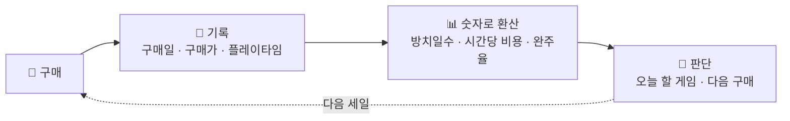
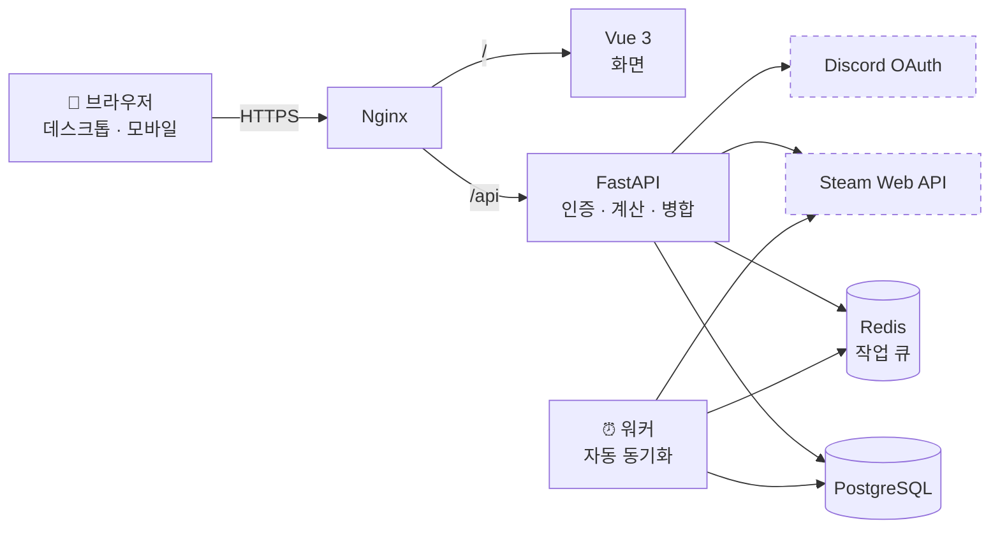
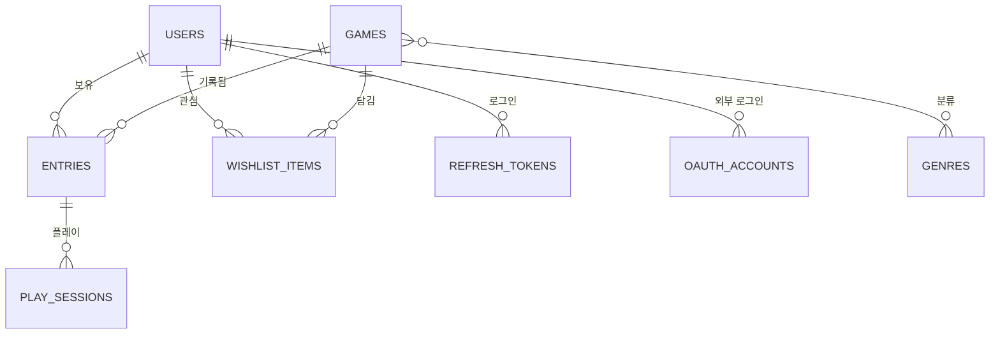

# PlayLedger

> 사놓고 안 한 게임을, 감이 아니라 숫자로 관리하는 웹 서비스


스팀 세일 때마다 게임을 사지만 실제로 플레이하는 비율은 그보다 훨씬 낮습니다.
문제는 "많이 샀다"가 아니라 **내가 얼마나 안 하고 있는지를 모른다**는 것입니다.

PlayLedger는 보유 목록이 아니라 **소비 이력**을 기록합니다.
언제 얼마에 샀고, 얼마나 했고, 얼마나 방치했는지를 숫자로 환산해서 보여줍니다.

> **현재 상태: M0(환경 구성) 완료 · M1(백엔드 기초) 진행 중**
>
> Vue 3 + FastAPI 스택으로 재설계했습니다. 인증(가입 · 로그인 · 토큰 재발급 · 로그아웃)과
> 보유 기록 CRUD를 API로 구현했고, 지금은 자동 테스트와 CI를 붙이는 중입니다.
> React Native + Django로 진행하던 이전 버전은 [`v0-rn-django`](../../tree/v0-rn-django) 태그에 보존되어 있습니다.

---

## 한눈에 보기



---

## 왜 만드는가

라이브러리 화면을 아무리 들여다봐도 아래 질문에는 답할 수 없습니다.

- 작년에 산 것 중에 아직 시작도 안 한 게 몇 개인가
- 정가 주고 산 게임을 2시간 하고 접었으면 시간당 얼마인가
- 어떤 장르를 사놓고 안 하는 경향이 있는가

이 질문들에 답하려면 **구매 시점과 플레이 시간을 함께 기록**해야 합니다.
PlayLedger가 하는 일이 그것입니다.

---

## 주요 기능

### 기록 · v1.0

- 게임별 구매일 / 구매가 / 플레이타임 기록
- 5단계 진행 상태 관리 (미시작 · 플레이중 · 클리어 · 보류 · 포기)
- 클리어 또는 포기 시 평점과 한줄평

### 분석 · v1.0

- **방치일수** — 미시작 게임이 구매 후 며칠 지났는지
- **시간당 비용** — `구매가 ÷ 플레이타임`. 본전을 뽑았는지 판단
- **사장률** — 플레이타임 1시간 미만 게임의 비율
- **완주율** — 시작한 게임 중 끝낸 비율
- **장르별 통계** — 어떤 장르를 사놓고 안 하는지

### 결정 돕기 · v1.1 ~ v1.2

- **🎲 오늘 뭐 할까** — 미시작 게임 중 하나를 룰렛으로 추첨
- **위시리스트 + 구매 전 경고** — "이 장르 완주율 18%, 미시작 7개"를 사기 전에 보여줌

### 자동화 · v2.0 ~ v2.1

- Steam 라이브러리 동기화 (매일 자동)
- 플레이 세션 기록 + 활동 히트맵
- 자동 수집 데이터와 직접 입력한 데이터를 충돌 없이 병합
- Discord 로그인

---

## 지표 설계 노트

### 완주율의 분모에서 미시작을 제외한 이유

```
완주율 = 클리어 수 ÷ (전체 - 미시작) × 100
```

시작도 안 한 게임을 "완주 실패"로 세면 **게임을 살수록 완주율이 떨어지는**
이상한 지표가 됩니다. 완주율은 "시작한 것 중 끝낸 비율"이어야 의미가 있습니다.

### 이 숫자들은 평가가 아닙니다

30시간짜리 게임을 5시간만 하고 접었어도, 그 5시간이 즐거웠으면 그걸로 된 것입니다.
지표는 "내가 어떤 패턴으로 게임을 사고 있는가"를 보여주는 용도이고,
구매 결정은 사람이 합니다. 그래서 구매 전 경고도 숫자를 보여줄 뿐 구매를 막지 않습니다.

---

## 시스템 구조



**화면은 표시만, 서버는 판단만.**
모든 계산은 서버에서 합니다. 계산식이 바뀌어도 서버만 고치면 되고,
계산 로직을 자동 테스트로 한 곳에서 검증할 수 있습니다.

인증 흐름, Steam 동기화 규칙 등 자세한 내용은 [시스템 아키텍처 문서](docs/02_architecture.md)에 있습니다.

---

## 기술 스택

| 구분 | 기술 | 역할 |
|---|---|---|
| 프론트엔드 | Vue 3, TypeScript, Vite | 화면 전체 |
| | Vue Router, Pinia | 화면 이동, 로그인 상태 관리 |
| | Tailwind CSS, shadcn-vue | UI 구성 |
| | ECharts, Motion | 통계 차트, 인터랙션 |
| 백엔드 | FastAPI, Pydantic | REST API, 입력 검증 |
| | SQLAlchemy(async), Alembic | DB 접근, 마이그레이션 |
| | JWT, OAuth 2.0 | 인증 (이메일 로그인 + Discord) |
| | httpx | Steam API 호출 |
| 데이터 | PostgreSQL | 영구 저장 |
| | Redis | 자동 동기화 작업 큐 |
| 테스트 · 운영 | pytest, GitHub Actions | 자동 테스트, CI |
| | Docker Compose, Nginx | 실행 환경, 배포 |

기술별 선택 이유는 [시스템 아키텍처 문서 3장](docs/02_architecture.md)에 있습니다.

---

## 데이터 모델



**핵심 설계 판단**

- `games`(게임 자체 정보)와 `entries`(내 보유 기록)를 분리 — 사용자가 늘어도 게임 정보는 한 번만 저장
- 위시리스트를 `entries`와 별도 테이블로 분리 — 통계 쿼리마다 "위시리스트 제외" 조건을 붙이다 빠뜨리는 실수를 구조로 차단
- `entries.source` 컬럼 — Steam 동기화가 직접 입력한 데이터를 덮어쓰지 못하게 막는 장치
- 플레이타임을 분 단위 정수로 저장 — 동기화 증가분을 세션으로 기록할 때 반올림 오차가 쌓이지 않음

전체 스키마와 근거는 [데이터 모델 문서](docs/03_erd.md)에 있습니다.

---

## 프로젝트 구조

```
playledger/
│
├── server/                 # FastAPI
│   ├── app/
│   │   ├── routers/        # URL ↔ 함수 연결
│   │   ├── schemas/        # 요청 · 응답 모양
│   │   ├── services/       # 계산 · 판별 · 병합
│   │   ├── models/         # 테이블 정의
│   │   └── core/           # 설정, DB, 보안
│   ├── alembic/            # 마이그레이션
│   └── tests/
│
├── web/                    # Vue 3
│   └── src/
│       ├── api/            # API 호출 모듈
│       ├── stores/         # Pinia
│       ├── router/
│       ├── views/
│       └── components/
│
├── docs/                   # 설계 문서
└── docker-compose.yml
```

> 계획 구조입니다. `core/`, `alembic/`처럼 이미 만들어진 폴더도 있고,
> 나머지는 필요한 마일스톤에서 생성합니다.

---

## 로드맵

| 버전 | 내용 | 상태 |
|:---:|---|:---:|
| **v1.0** | 기록 · 상태 관리 · 통계 대시보드 | 🔄 진행중 |
| v1.1 | 배포, 다음 게임 추첨 | ⏳ 예정 |
| v1.2 | 위시리스트 + 구매 전 경고 | ⏳ 예정 |
| v2.0 | Steam 자동 동기화, 플레이 세션 + 히트맵 | ⏳ 예정 |
| v2.1 | Discord 로그인 | ⏳ 예정 |

**v1.0이 완결된 앱입니다.** 이후 버전은 그 위에 하나씩 얹는 확장이고,
어느 단계에서 멈춰도 그 시점까지는 완성품으로 남도록 순서를 잡았습니다.

마일스톤별 진행 상황과 완료 기준은 [개발 일정 문서](docs/05_milestones.md)에 있습니다.

---

## 문서

| 문서 | 내용 |
|---|---|
| [요구사항 정의서](docs/01_requirements.md) | 기능 범위, 계산식, 유즈케이스, 하지 않을 것 |
| [시스템 아키텍처](docs/02_architecture.md) | 전체 구조, 기술 선택 근거, 인증 · 동기화 흐름 |
| [데이터 모델](docs/03_erd.md) | 테이블 9종, 관계 설계, 조회 쿼리 |
| [화면 설계서](docs/04_ui_design.md) | 화면 8종, 네비게이션, 상태 전환 |
| [개발 일정](docs/05_milestones.md) | 마일스톤, 완료 기준, 일정 리스크 |
| API 명세서 | 인증 흐름과 에러 규칙 *(작성 예정)* |
| [DEVLOG](docs/DEVLOG.md) | 세션별 작업 기록, 트러블슈팅 |

> 엔드포인트 목록은 FastAPI가 자동으로 만들어주는 Swagger 화면(`/docs`)으로 대신합니다.

---

## 시작하기

> 배포 구성(`docker compose up` 하나로 전체 기동)은 M5에서 작성됩니다.
> 아래는 개발 환경 기준입니다.

**최초 1회 — 클론 직후**

```powershell
# server/
python -m venv venv
.\venv\Scripts\Activate.ps1
pip install -r requirements.txt
Copy-Item .env.example .env   # 값 채우기

# web/
npm install

# 루트
Copy-Item .env.example .env   # 값 채우기
```

**실행 — 터미널 3개**

```powershell
# 1. DB 컨테이너 (루트)
docker compose up -d

# 2. 서버 (server/)
.\venv\Scripts\Activate.ps1
uvicorn app.main:app --reload --port 8001

# 3. 화면 (web/)
npm run dev
```

> `Activate.ps1` 실행이 차단되면 `Set-ExecutionPolicy -Scope CurrentUser RemoteSigned` 후 다시 시도합니다.

**사용 중인 포트와 설치 버전은 [DEVLOG 환경 요약](docs/DEVLOG.md#현재-상태)이 기준입니다.**

---

## 개발 환경

3대의 Windows 11 기기를 오가며 개발합니다.
어느 기기에서든 같은 절차(클론 → `.env` 작성 → `alembic upgrade head`)로 실행됩니다.

| 기기 | CPU | 메모리 | GPU |
|---|---|---|---|
| 데스크톱 A | AMD Ryzen 5 9600X | DDR5 32GB | RTX 5070 |
| 데스크톱 B | AMD Ryzen 9 5900X | DDR4 64GB | RTX 3080 |
| 노트북 (Lenovo IdeaPad Flex 5) | Intel Core i7-1255U | LPDDR4x 16GB | Iris Xe (내장) |

- **OS** · Windows 11 (공통)
- **대상** · 웹 (데스크톱 · 모바일 브라우저)
- **기기 간 이동** · 코드는 Git으로만 옮깁니다. `.env`와 DB 데이터는 Git으로 옮겨지지 않으므로 기기마다 따로 만듭니다

---

## 라이선스

MIT License *(LICENSE 파일은 추후 추가 예정)*
