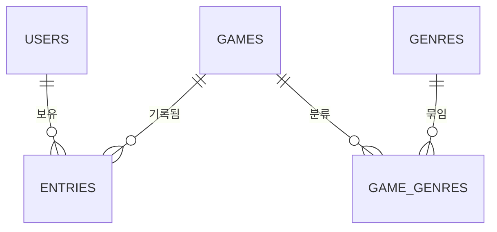

# PlayLedger

> 사놓고 안 한 게임을, 감이 아니라 숫자로 관리하는 모바일 앱

스팀 세일 때마다 게임을 사지만 실제로 플레이하는 비율은 그보다 훨씬 낮습니다.
문제는 "많이 샀다"가 아니라 **내가 얼마나 안 하고 있는지를 모른다**는 것입니다.

PlayLedger는 보유 목록이 아니라 **소비 이력**을 기록합니다.
언제 얼마에 샀고, 얼마나 했고, 얼마나 방치했는지를 숫자로 환산해서 보여줍니다.

> **현재 상태: M2(앱 연동) 진행 중** · 백엔드(M0~M1) 완료
>
> 서버 인증/CRUD와 앱 네비게이션 골격까지 구현되었습니다.
> 실행 방법은 M2 완료 후 이 문서에 추가됩니다.

---

## 왜 만드는가

라이브러리 화면을 아무리 들여다봐도 아래 질문에는 답할 수 없습니다.

- 작년에 산 것 중에 아직 시작도 안 한 게 몇 개인가
- 정가 주고 산 게임을 2시간 하고 접었으면 시간당 얼마인가
- 어떤 장르를 사놓고 안 하는 경향이 있는가

이 질문들에 답하려면 **구매 시점과 플레이 시간을 함께 기록**해야 합니다.
PlayLedger가 하는 일이 그것입니다.

### 왜 모바일인가

이 앱이 필요한 순간은 대부분 PC 앞이 아닙니다.
할인 소식을 보고 살지 말지 판단할 때, 대화 중에 추천받은 게임을 메모할 때,
오늘 뭘 할지 정할 때 — 전부 PC를 켜기 전입니다.

---

## 주요 기능

### 기록

- 게임별 구매일 / 구매가 / 플레이타임 기록
- 5단계 진행 상태 관리 (미시작 · 플레이중 · 클리어 · 보류 · 포기)
- 클리어 또는 포기 시 평점과 한줄평

### 분석

- **방치일수** — 미시작 게임이 구매 후 며칠 지났는지
- **시간당 비용** — `구매가 ÷ 플레이타임`. 본전을 뽑았는지 판단
- **사장률** — 플레이타임 1시간 미만 게임의 비율
- **완주율** — 시작한 게임 중 끝낸 비율
- **장르별 통계** — 어떤 장르를 사놓고 안 하는지

### 연동

- Steam 라이브러리 자동 동기화 (M5)
- 자동 수집 데이터와 직접 입력한 데이터를 충돌 없이 병합

---

## 지표 설계 노트

### 완주율의 분모에서 미시작을 제외한 이유

```
완주율 = 클리어 수 ÷ (전체 - 미시작) × 100
```

시작도 안 한 게임을 "완주 실패"로 세면 **게임을 살수록 완주율이 떨어지는**
이상한 지표가 됩니다. 완주율은 "시작한 것 중 끝낸 비율"이어야 의미가 있습니다.

### 이 숫자들은 평가가 아닙니다

30시간짜리 게임을 5시간만 하고 접었어도, 그 5시간이 즐거웠으면 그걸로 된 것입니다.
지표는 "내가 어떤 패턴으로 게임을 사고 있는가"를 보여주는 용도이고,
구매 결정은 사람이 합니다.

---

## 시스템 구조

```
┌──────────────────────────────┐
│      React Native 앱          │
│      (Android)               │
│  · 화면 렌더링                  │
│  · 토큰 보관 및 첨부             │
└──────────────┬───────────────┘
               │  HTTPS / JSON
               ↓
┌──────────────────────────────┐
│    Django + DRF 서버          │
│  · 인증 / 권한 검사             │
│  · 지표 계산                   │
│  · Steam API 중계 (M5)        │
└──────┬────────────────┬──────┘
       │ SQL            │ HTTPS
       ↓                ↓
┌─────────────┐   ┌──────────────────┐
│  MariaDB    │   │  Steam Web API   │
└─────────────┘   └──────────────────┘
```

**앱은 화면만, 서버는 판단만.**
모든 계산은 서버에서 합니다. 계산식이 바뀌어도 앱을 재배포할 필요가 없고,
나중에 다른 클라이언트가 붙어도 같은 결과를 보장합니다.

자세한 내용은 [시스템 아키텍처 문서](docs/02_architecture.md)를 참고하세요.

---

## 기술 스택

| 구분 | 기술 | 선택 이유 |
|---|---|---|
| 앱 | React Native | 학과 JavaScript 수업과 직결. Flutter와 다른 접근 경험 |
| 백엔드 | Django + DRF | 인증이 기본 내장. 직접 구현 시 보안 사고 위험이 큰 영역 |
| DB | MariaDB | 다중 사용자 전제. 학과 커리큘럼 DBMS |
| 인증 | 토큰 기반 | 모바일 앱에는 브라우저 쿠키가 없음 |
| 외부 연동 | Steam Web API | 라이브러리 자동 수집 (M5) |

---

## 데이터 모델



**핵심 설계 판단**

- `games`(게임 자체 정보)와 `entries`(내 보유 기록)를 분리 — 사용자가 늘어도 게임 정보는 한 번만 저장
- 장르는 `game_genres` 연결 테이블로 N:M 처리 — 문자열로 이어 붙이면 장르별 통계가 불가능
- `entries.source` 컬럼 — Steam 동기화가 직접 입력한 데이터를 덮어쓰지 못하게 막는 장치

전체 스키마와 근거는 [데이터 모델 문서](docs/ERD.md)에 있습니다.

---

## 프로젝트 구조

```
playledger/
│
├── server/                # Django 프로젝트
│   ├── config/            # settings, urls
│   ├── accounts/          # 인증
│   ├── library/           # 게임 / 보유기록
│   ├── manage.py
│   ├── requirements.txt
│   └── .env.example
│
├── app/                   # React Native
│   └── src/
│       ├── screens/
│       ├── components/
│       ├── api/           # API 호출 모듈
│       └── navigation/
│
├── docs/                  # 설계 문서
│
├── .gitignore
├── LICENSE
└── README.md
```

> 구조는 개발 진행에 따라 변경될 수 있습니다.

---

## 개발 로드맵

| 단계 | 내용 | 상태 |
|---|---|:---:|
| M0 | 환경 구성 | ✅ 완료 |
| M1 | 백엔드 기초 (인증 + CRUD) | ✅ 완료 |
| M2 | 앱 연동 | 🔄 진행중 |
| M3 | 상태 관리 + 평점 | ⏳ 예정 |
| M4 | 통계 대시보드 (**v1.0**) | ⏳ 예정 |
| M5 | Steam API 연동 | ⏳ 예정 |
| M6 | 문서화 및 정리 | ⏳ 예정 |

**M4까지가 v1.0입니다.** Steam 연동 없이도 완결된 앱이어야 하고,
M5는 그 위에 얹는 확장입니다. M5에서 막히더라도 보여줄 수 있는
결과물이 남도록 순서를 잡았습니다.

단계별 완료 기준은 [개발 일정 문서](docs/05_milestones.md)에 있습니다.

---

## 문서

| 문서 | 내용 |
|---|---|
| [요구사항 정의서](docs/01_requirements.md) | 기능 범위, 계산식, 하지 않을 것 |
| [시스템 아키텍처](docs/02_architecture.md) | 전체 구조, 기술 선택 근거, 인증 흐름 |
| [API 명세서](docs/03_api_spec.md) | 엔드포인트, 데이터 모델 *(M1 이후 작성)* |
| [화면 설계서](docs/04_ui_design.md) | 화면 6종, 네비게이션, 상태 표시 규칙 |
| [개발 일정](docs/05_milestones.md) | 마일스톤, 완료 기준, 리스크 |
| [데이터 모델](docs/ERD.md) | 테이블 5종, 관계 설계, 조회 패턴 |
| [DEVLOG](docs/DEVLOG.md) | 세션별 작업 기록, 트러블슈팅 |

> API 명세서를 M1 이후로 미룬 이유: DRF가 기본 제공하는 URL 구조를
> 확인한 뒤에 작성해야 실제 구현과 어긋나지 않습니다.

---

## 시작하기

> **M2 완료 후 작성 예정입니다.**
>
> 다음 내용이 추가됩니다.
> - Python / Node.js 버전 요구사항
> - MariaDB 설치 및 DB 생성
> - `.env` 설정 방법
> - 서버 및 앱 실행 절차

---

## 개발 환경

| 항목 | 값 |
|---|---|
| OS | Windows 11 |
| 개발 기기 | Ryzen 5 9600X / RTX 5070 / DDR5 32GB |
| 대상 플랫폼 | Android |

---

## 라이선스

이 프로젝트는 [MIT License](LICENSE)를 따릅니다.
