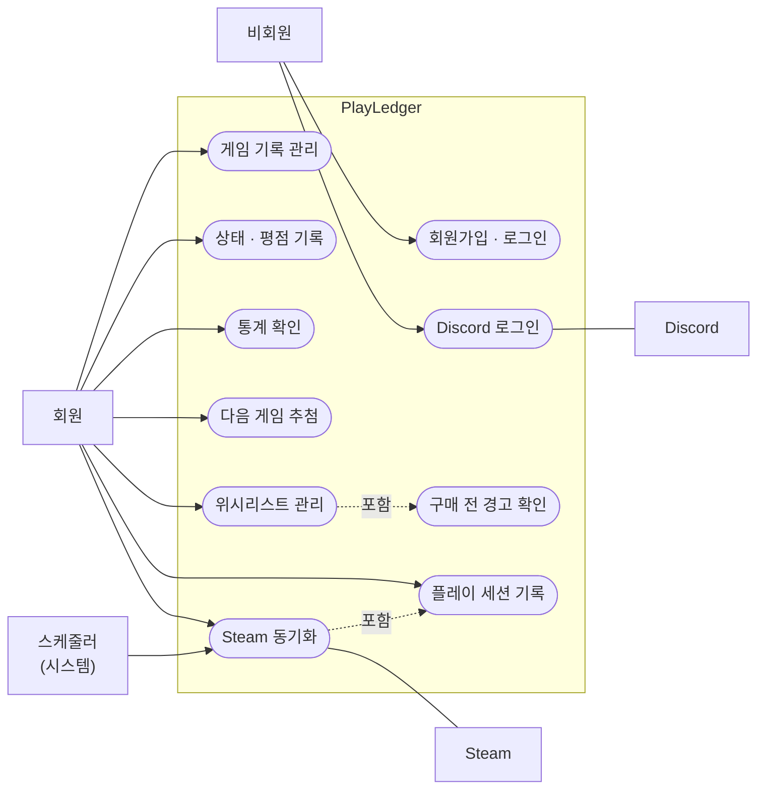

# PlayLedger — 요구사항 정의서
 
> 게임 라이브러리를 "장부"처럼 기록하고, 사놓고 안 한 게임을 데이터로 관리하는 웹 서비스
>
> 작성일: 2026-08-13 / 개정일: 2026-09-20 / 상태: v1.4
 
---
 
## 1. 개요
 
### 1.1 왜 만드는가
 
스팀 세일 때마다 게임을 사지만, 실제로 플레이하는 비율은 그보다 훨씬 낮다.
문제는 "많이 샀다"가 아니라 **내가 얼마나 안 하고 있는지를 모른다**는 것이다.
 
- "이 게임 산 게 언제였지?"
- "작년에 산 것 중에 아직 시작도 안 한 게 몇 개야?"
- "정가 6만원 주고 산 게임, 결국 2시간 하고 접었으면 시간당 3만원인데?"
라이브러리 목록을 보는 것만으로는 이 질문에 답할 수 없다.

**보유 목록이 아니라 소비 이력을 기록하고, 그걸 숫자로 환산하는 것**이 이 프로젝트의 목적이다.
 
### 1.2 학습 목표
 
결과물과 별개로, 이 프로젝트로 익히려는 것:
 
| 영역 | 목표 |
|---|---|
| 백엔드 | FastAPI 비동기 구조, Pydantic 스키마 설계, SQLAlchemy(async) ORM, Alembic 마이그레이션 |
| 인증 | JWT access / refresh 토큰, httpOnly 쿠키, OAuth 2.0(Discord), 사용자별 데이터 격리 |
| 프론트엔드 | Vue 3 컴포넌트·라우팅, Pinia 전역 상태, Tailwind + shadcn-vue UI, ECharts 시각화, Motion 인터랙션 |
| 외부 API | Steam Web API 연동, 외부 데이터와 로컬 데이터 병합 |
| 비동기 작업 | Redis 기반 작업 큐로 주기적 동기화 |
| DB 설계 | 다대다 관계, 정규화, 사용자-데이터 관계 모델링 (PostgreSQL) |
| 테스트·운영 | pytest 자동 테스트, GitHub Actions CI, Docker Compose, Nginx 배포 |
 
### 1.3 기존 프로젝트와의 관계
 
| 프로젝트 | 성격 | 이번에 새로 하는 것 |
|---|---|---|
| PulseGrid | 실시간 모니터링 / FastAPI / 웹 | — |
| PartScope | 배치 분석 / SQLite / 콘솔 | — |
| **PlayLedger** | **기록·분석 / FastAPI + Vue / 웹** | **DB·인증을 포함한 전체 백엔드, 프론트엔드 프레임워크, 작업 큐, 배포** |

FastAPI는 PulseGrid에서 다뤘지만, 이번에는 DB 접근·인증·테스트까지 포함한 완결된 백엔드로 확장한다.
 
---
 
## 2. 용어 정의
 
| 용어 | 정의 |
|---|---|
| 게임(Game) | 게임 자체의 정보. 제목, 장르 등. 모든 사용자가 공유하는 마스터 데이터 |
| 보유 기록(Entry) | 특정 사용자가 특정 게임을 소유한 기록. 구매일, 구매가, 상태, 평점 등 |
| 백로그(Backlog) | 구매했으나 아직 시작하지 않은 게임 |
| 방치일수 | 구매일로부터 오늘까지의 일수 (상태가 '미시작'인 경우에만 의미 있음) |
| 시간당 비용 | 구매가 ÷ 총 플레이타임. 낮을수록 본전을 뽑은 것 |
| 사장률 | 전체 보유 게임 중 플레이타임 1시간 미만인 게임의 비율 |
| 위시리스트(Wishlist) | 아직 구매하지 않은 관심 게임. 보유 기록과 별도로 저장한다 |
| 플레이 세션(Session) | 특정 날짜에 특정 게임을 플레이한 기록. 직접 입력하거나 Steam 동기화로 자동 생성된다 |
 
---
 
## 3. 범위
 
### 3.1 하는 것
 
- 게임 보유 기록의 등록 / 조회 / 수정 / 삭제
- 진행 상태 관리 및 상태별 필터링
- 평점 및 한줄평 기록
- 보유 현황 통계 및 백로그 분석
- 회원가입 및 로그인 (사용자별 데이터 분리)
- 배포 및 실사용 (v1.1)
- "다음에 뭐 할까" 추첨 (v1.1)
- 위시리스트 및 구매 전 경고 (v1.2)
- Steam 라이브러리 동기화 · 자동 동기화 · 플레이 세션 기록 (v2.0)
- Discord 로그인 (v2.1)

### 3.2 하지 않는 것 (Out of scope)
 
| 항목 | 이유 |
|---|---|
| 게임 추천 알고리즘 | 범위가 급격히 커지고, 이 프로젝트의 문제의식과 무관 |
| 소셜 기능 (친구, 공유, 댓글) | 핵심 문제 해결에 불필요 |
| 게임 구매 / 가격 비교 | PartScope와 성격이 겹침 |
| 네이티브 모바일 앱 | 반응형 웹으로 모바일 브라우저에 대응. v0에서는 반대로 웹을 제외했음 (변경 이력 v1.0 참고) |
| 타 플랫폼 연동 (Epic, GOG, PlayStation) | 사용자 라이브러리를 조회하는 공개 API가 없음 |

---
 
## 4. 기능 요구사항

### 4.0 기능 개요 (유즈케이스)



> mermaid는 UML 유즈케이스 다이어그램을 공식 지원하지 않아 flowchart로 표현했다.
> 네모는 행위자, 타원은 유즈케이스, 점선 "포함"은 앞의 기능을 쓰면 뒤의 기능이 함께 일어남을 뜻한다.
 
### 4.1 필수 (MVP)
 
| # | 기능 | 설명 | 우선순위 |
|---|------|------|:---:|
| F-01 | 회원가입 / 로그인 | 이메일 + 비밀번호. JWT access 토큰 + refresh 토큰(httpOnly 쿠키). 사용자별로 데이터가 완전히 분리된다 | 필수 |
| F-02 | 게임 등록 | 제목, 장르, 구매일, 구매가를 수동 입력 | 필수 |
| F-03 | 목록 조회 | 보유 게임 목록. 상태별 / 장르별 필터, 정렬 | 필수 |
| F-04 | 상태 관리 | 미시작 / 플레이중 / 클리어 / 보류 / 포기 5단계 전환 | 필수 |
| F-05 | 수정 / 삭제 | 등록한 기록의 수정 및 삭제 | 필수 |
| F-06 | 평점 / 한줄평 | 클리어 또는 포기 시 5점 척도 평점과 한줄평 기록 | 필수 |
| F-07 | 플레이타임 기록 | 총 플레이 시간을 시간 단위로 입력. 세션 기록(F-20) 도입 후 계산 규칙은 5.5절 | 필수 |
 
### 4.2 핵심 차별 기능
 
| # | 기능 | 설명 | 우선순위 |
|---|------|------|:---:|
| F-08 | 백로그 대시보드 | 총 보유 수, 미시작 수, 클리어율, 사장률을 한 화면에 표시 | 높음 |
| F-09 | 방치 게임 추출 | 구매 후 N일 이상 미시작인 게임을 자동으로 골라냄 | 높음 |
| F-10 | 시간당 비용 계산 | 게임별 `구매가 ÷ 플레이타임` 산출 및 정렬 | 높음 |
| F-11 | 장르별 통계 | 장르별 보유 수 / 완주율 / 평균 플레이타임 시각화 | 중간 |
| F-12 | Steam 연동 | Steam Web API로 라이브러리와 플레이타임 수집 (수동 실행) | 높음 |
 
### 4.3 확장 기능 (v1.1 이후)

| # | 기능 | 설명 | 목표 버전 |
|---|------|------|:---:|
| F-14 | "다음에 뭐 할까" 추첨 | 미시작 게임 중 무작위 1개를 룰렛 애니메이션으로 제안 | v1.1 |
| F-13 | 위시리스트 | 구매 전 관심 게임을 관리. 구매하면 보유 기록으로 전환 | v1.2 |
| F-18 | 구매 전 경고 | 위시리스트 등록·구매 전환 시 해당 장르의 완주율과 미시작 수를 근거로 경고 표시 | v1.2 |
| F-19 | Steam 자동 동기화 | 정해진 주기로 백그라운드에서 동기화 (Redis 작업 큐) | v2.0 |
| F-20 | 플레이 세션 기록 + 활동 히트맵 | 날짜별 플레이 기록, 캘린더 히트맵으로 시각화 | v2.0 |
| F-21 | Discord 로그인 | OAuth 2.0 로그인, 기존 계정과 연결 | v2.1 |

### 4.4 있으면 좋은 것 (버전 미정)

| # | 기능 | 설명 | 우선순위 |
|---|------|------|:---:|
| F-15 | 월별 구매 추이 | 언제 많이 샀는지 그래프 | 낮음 |
| F-16 | 데이터 내보내기 | CSV / JSON 내보내기 | 낮음 |
| F-17 | 비밀번호 정책 강제 | 길이 외 복잡도 규칙을 회원가입 스키마 검증에 적용 | 낮음 |
| F-22 | 게임 커버 아트 | Steam 게임은 appid 기반 이미지 표시 | 낮음 |
| F-23 | 게임 마스터 관리자 화면 | 공유 테이블 `games`의 중복 병합·제목 수정 | 낮음 |
| F-24 | 다크 모드 | 시스템 설정 연동 + 수동 전환 | 낮음 |
| F-25 | 연말 결산 | 1년 소비 이력 요약 화면 | 낮음 |
| F-26 | 플랫폼 · 구매처 기록 | 구매 플랫폼과 스토어를 기록해 스토어별 구매 패턴 분석. 도입 시 `entries`에 컬럼 추가 | 낮음 |
| F-27 | 이메일 인증 | 가입 시 인증 메일 발송. 계정 존재 여부 노출(enumeration) 차단 겸용 | 낮음 |

---
 
## 5. 핵심 계산식
 
### 5.1 시간당 비용
 
```
시간당 비용 = 구매가(원) ÷ 총 플레이타임(시간)
```
 
낮을수록 본전을 뽑은 것. 플레이타임이 0인 경우 계산하지 않고 `-`로 표시한다.
 
> 예시
> - 게임 A / 66,000원 / 40시간 → 1,650원/시간
> - 게임 B / 66,000원 / 2시간 → 33,000원/시간
 
### 5.2 사장률
 
```
사장률 = (플레이타임 1시간 미만 게임 수 ÷ 전체 보유 게임 수) × 100
```
 
### 5.3 완주율
 
```
완주율 = (클리어 상태 게임 수 ÷ (전체 - 미시작)) × 100
```
 
**분모에서 미시작을 제외하는 이유:** 시작도 안 한 게임을 "완주 실패"로 세면
게임을 살수록 완주율이 떨어지는 이상한 지표가 된다. 완주율은
"시작한 것 중 끝낸 비율"이어야 의미가 있다.
 
### 5.4 지표 해석 주의
 
이 숫자들은 **판단 보조용이지 평가가 아니다.**
30시간짜리 게임을 5시간만 하고 접었어도 그 5시간이 즐거웠으면 그걸로 된 것이다.
지표는 "내가 어떤 패턴으로 게임을 사고 있는가"를 보여주는 용도이고,
구매 결정은 사람이 한다.

### 5.5 플레이타임 출처 규칙

플레이타임의 출처가 셋(직접 입력, Steam, 세션 합계)이 되므로 기준을 하나로 정한다.

| 게임 출처 | 총 플레이타임 | 세션 기록 |
|---|---|---|
| 수동 등록 | 직접 입력한 값이 기준점. 세션을 추가하면 그만큼 더해진다 | 사용자가 직접 추가 |
| Steam | Steam이 제공하는 누적값 | 동기화 때 "지난 동기화 대비 증가분"을 그날의 세션으로 자동 생성 |

두 경우 모두 **기준점 + 이후 증가분** 구조다. 세션을 기록하기 전의 플레이타임은
기준점에 들어 있으므로 사라지지 않는다.
 
---
 
## 6. 데이터 모델 초안
 
> 상세 ERD는 `docs/03_erd.md`에서 별도 작성
 
### 6.1 주요 테이블
 
| 테이블 | 역할 |
|---|---|
| `users` | 사용자 계정. Discord로만 가입한 계정은 비밀번호가 없음 |
| `refresh_tokens` | 발급한 refresh 토큰 (로그아웃·강제 만료용) |
| `oauth_accounts` | 외부 로그인 연결 (provider, provider_user_id) |
| `games` | 게임 마스터 데이터 (제목, 정규화 제목, steam_appid) |
| `genres` | 장르 |
| `game_genres` | 게임-장르 다대다 연결 |
| `entries` | 사용자별 보유 기록 (구매일, 구매가, 상태, 평점, 플레이타임) |
| `wishlist_items` | 사용자별 위시리스트 |
| `play_sessions` | 보유 기록별 날짜 단위 플레이 기록 |
 
### 6.2 설계 판단
 
**`games`와 `entries`를 나누는 이유**
 
같은 게임을 여러 사용자가 보유할 수 있다. 게임 제목과 장르를 사용자마다
중복 저장하면 데이터가 낭비되고, 게임 정보를 고칠 때 모든 행을 고쳐야 한다.
게임 자체의 정보(`games`)와 "내가 언제 얼마에 샀고 얼마나 했는지"(`entries`)를
분리하면 이 문제가 사라진다.
 
**상태(status) 값**
 
`BACKLOG` (미시작) / `PLAYING` (플레이중) / `CLEARED` (클리어) /
`ON_HOLD` (보류) / `DROPPED` (포기)
 
'보류'와 '포기'를 나누는 이유는 백로그 분석 대상이 다르기 때문이다.
보류는 언젠가 돌아올 게임이고, 포기는 이미 끝난 게임이다.

**위시리스트를 `entries`와 나누는 이유**

`entries.status`에 `WISHLIST`를 추가하면 사장률·완주율·방치 게임 등
모든 통계 쿼리에 "위시리스트 제외" 조건을 붙여야 한다. 하나라도 빠뜨리면
통계가 오류 없이 조용히 틀린다. 실수할 여지를 조건문이 아니라
테이블 구조로 없앤다. 구매하면 `wishlist_items`에서 `entries`로 옮긴다.
 
---
 
## 7. 비기능 요구사항
 
| 항목 | 요구사항 |
|---|---|
| 성능 | 게임 200개 기준 목록 조회 1초 이내 |
| 보안 | 비밀번호는 평문 저장 금지 (해싱 라이브러리는 10장 참고) |
| 인증 | access 토큰은 짧은 수명, refresh 토큰은 DB 저장 + httpOnly 쿠키. 다른 사용자의 데이터는 조회 불가 |
| 개인정보 | Steam ID, Discord 사용자 ID 외의 개인정보는 수집하지 않음 |
| 설정 관리 | API 키, DB 비밀번호, OAuth 클라이언트 시크릿은 Git에 올리지 않음 (`.env`) |
| 테스트 | 사용자 격리와 계산식은 pytest로 자동 검증, push마다 CI 실행 |
| 대상 환경 | 데스크톱 브라우저 우선, 모바일 브라우저는 반응형으로 대응 |
 
---
 
## 8. 제약 조건 및 리스크
 
| # | 리스크 | 영향 | 대응 |
|---|---|---|---|
| R-01 | Steam 프로필이 비공개면 API 조회 불가 | F-12 동작 안 함 | 공개 설정 안내 문구 표시. 수동 입력으로 대체 가능하도록 설계 |
| R-02 | Steam API 호출 제한 | 동기화 실패 | 자동 동기화는 하루 1회로 제한, 응답은 Redis에 캐싱 |
| R-03 | Steam에 없는 게임 (콘솔, 패키지) | 자동 수집 누락 | 수동 등록 경로를 항상 유지 |
| R-04 | 게임 제목 표기 불일치 (한글/영문/부제) | 중복 등록 | `steam_appid`를 우선 식별자로 사용. 없으면 제목 정규화 후 비교 |
| R-05 | 비동기 SQLAlchemy 학습 곡선 | M1 지연 | 동기 방식보다 자료가 적고, 연관 데이터 지연 로딩이 막혀 있음. M1에 가장 긴 기간 배분 |
| R-06 | 두 스택 동시 학습 혼란 | 전체 지연 | 백엔드(M1) 완료 후 프론트(M2) 착수. 겹치지 않게 진행 |
| R-07 | 같은 사람이 이메일·Discord로 계정 2개 생성 | 데이터 분산 | 계정 연결 정책을 M11 착수 시 결정 (10장) |
| R-08 | 마감 없는 범위 확대 | 완성 시점 소실 | 버전별 결승선(v1.0 ~ v2.1) 유지. 새 아이디어는 4.4절에 추가만 |
 
---
 
## 9. 마일스톤

| 버전 | 마일스톤 | 포함 기능 |
|:---:|---|---|
| **v1.0** | M0 환경 구성 ~ M4 통계 대시보드 | F-01 ~ F-11 |
| v1.1 | M5 배포, M6 추첨 | F-14 |
| v1.2 | M7 위시리스트 | F-13, F-18 |
| v2.0 | M8 Steam 동기화, M9 자동 동기화, M10 플레이 세션 | F-12, F-19, F-20 |
| v2.1 | M11 Discord 로그인 | F-21 |

작업 목록과 완료 기준은 `05_milestones.md`에서 관리한다.

**v1.0이 완결된 앱이다.** 이후 버전은 그 위에 하나씩 얹는 확장이고,
어느 단계에서 멈춰도 그 시점까지는 완성품으로 남는다.
 
---
 
## 10. 미결정 사항
 
작업하면서 정할 것들. 지금 결정하지 않는다.
 
- [x] ~~인증 방식: DRF TokenAuthentication~~ → **재설계로 JWT + DB 저장 refresh 토큰으로 재결정** (웹 클라이언트라 httpOnly 쿠키 보관이 필요하고, 학습 목표에 JWT 포함)
- [x] ~~RN 환경: RN CLI~~ → 재설계로 해당 없음
- [x] 상태 관리 라이브러리 → **Pinia**
- [x] 통계 시각화 → **ECharts**
- [ ] 장르 데이터 출처 (직접 입력 vs Steam 태그 활용)
- [x] 비밀번호 해싱 라이브러리 → **argon2-cffi (Argon2id)**
- [ ] Redis 작업 큐 도구 (M9 착수 시)
- [ ] 배포 환경: 집 PC 서버 vs 클라우드 (M5 착수 시)
- [ ] Discord 계정 연결 정책: 같은 이메일 자동 연결 vs 로그인 상태에서 수동 연결 (M11 착수 시)

---
 
## 변경 이력
 
| 날짜 | 버전 | 내용 |
|---|---|---|
| 2026-08-13 | v0.1 | 최초 작성 |
| 2026-08-13 | v0.2 | 3.1절 Steam 라이브러리 자동 동기화 (M4) 부분을 05.milestones.md 문서와 맞게 Steam 라이브러리 자동 동기화 (M5)로 변경 |
| 2026-08-14 | v0.3 | 10장 미결정 사항 중 "RN 환경" 결정 완료로 이관 (Expo vs CLI → CLI로 확정, M0 완료 시점) |
| 2026-08-17 | v0.4 | 10장 인증 방식 결정 완료로 이관 (토큰 vs JWT → DRF 기본 TokenAuthentication 확정), 4.3절에 비밀번호 정책 검증기 항목 추가 |
| 2026-09-18 | v1.0 | 스택 전환(RN + Django + MariaDB → Vue 3 + FastAPI + PostgreSQL)에 따른 전면 개정. 대상을 모바일 앱 → 웹으로 변경(3.2절 반전), 확장 기능 F-18~F-21 신설 및 F-13·F-14 승격, 3.3절을 4.4절로 통합, 플레이타임 출처 규칙(5.5절) 신설, R-02를 자동 동기화에 맞게 수정. 개정 전 문서는 `v0-rn-django` 태그, 전환 사유는 DEVLOG 결정 기록 참고 |
| 2026-09-18 | v1.1 | 5.5절 수동 등록 게임의 플레이타임 규칙 정정 (세션 합계로 대체 → 기준점 + 세션 증가분). 기존 규칙은 세션 기록 전 플레이타임이 사라지는 문제가 있었음 |
| 2026-09-18 | v1.2 | 4.0절 유즈케이스 다이어그램 추가 |
| 2026-09-18 | v1.3 | F-02에서 플랫폼 · 구매처 제외 (v0부터 데이터 모델에 대응 컬럼이 없었고, 이를 사용하는 통계도 없음). 4.4절 F-26으로 이관, 2장 게임 정의에서 플랫폼 표현 삭제 |
| 2026-09-20 | v1.4 | 10장 비밀번호 해싱 라이브러리 결정 완료로 이관 (passlib vs bcrypt vs argon2-cffi → argon2-cffi 확정). 4.4절에 F-27(이메일 인증) 추가 — 가입 시 계정 존재 여부 노출을 막으려면 메일 인프라가 필요해 v1.0 범위에서 제외. 사유는 DEVLOG 2026-09-20 결정 기록 참고 |
