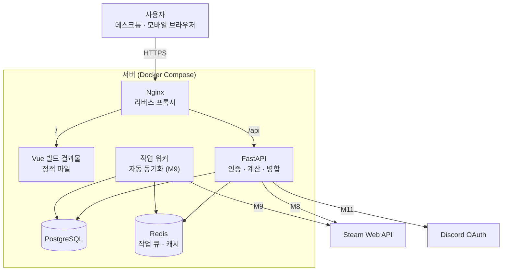
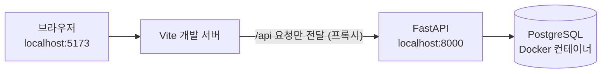
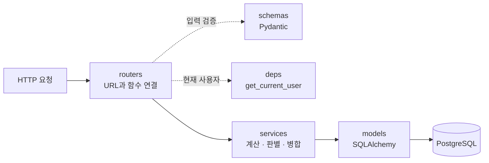
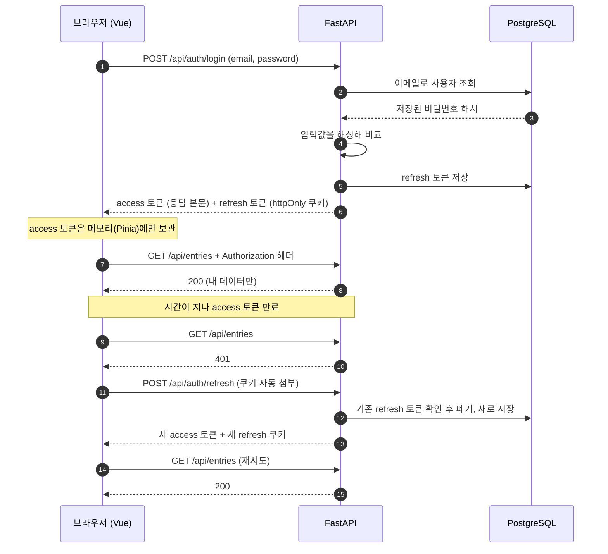
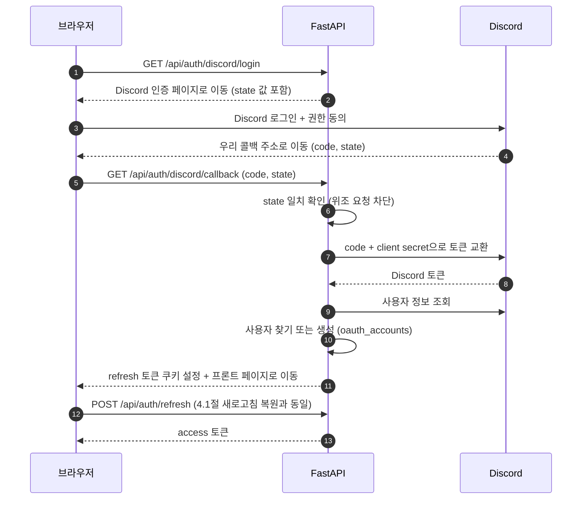
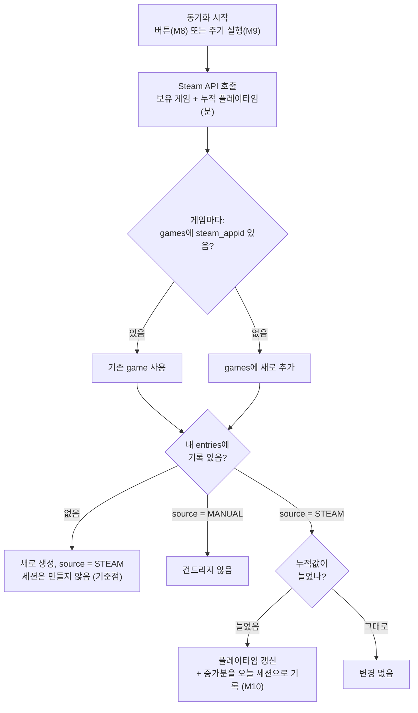
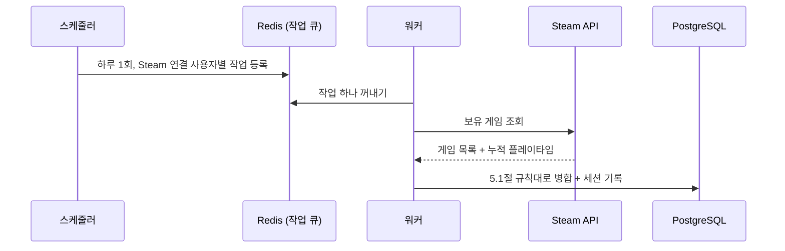

# PlayLedger — 시스템 아키텍처 문서

> 게임 라이브러리를 기록하고 분석하는 웹 서비스

- **작성일**: 2026-08-13
- **개정일**: 2026-09-18
- **작성자**: 사공민규
- **버전**: v1.0
- **관련 문서**: 요구사항 정의서(01), 데이터 모델(03)

---

## 1. 전체 구조

### 1.1 운영 환경



### 1.2 개발 환경



**핵심 원칙: 화면은 표시만, 서버는 판단만.**

방치일수, 완주율, 시간당 비용 같은 계산은 전부 서버에서 한다.
프론트엔드는 받은 숫자를 표시할 뿐이다. 계산식이 바뀌어도 서버만 고치면 되고,
계산 로직을 pytest로 한 곳에서 검증할 수 있다.

**같은 출처(Same-Origin) 원칙**

운영에서는 Nginx가, 개발에서는 Vite 프록시가 화면과 API를 같은 주소 아래로 묶는다.
브라우저 입장에서 둘이 한 사이트처럼 보이므로 CORS 설정이 필요 없고,
refresh 토큰 쿠키도 추가 설정 없이 자동으로 첨부된다.

---

## 2. 컴포넌트별 역할

### 2.1 Vue 프론트엔드

| 항목 | 내용 |
|---|---|
| 역할 | 사용자 인터페이스 전담 |
| 하는 일 | 화면 그리기, 입력 받기, API 호출, access 토큰 메모리 보관 |
| 하지 않는 일 | 통계 계산, 중복 판별, 데이터 정규화 |

입력값 검증은 프론트에서도 하고 서버에서도 한다. 프론트 검증은
**사용자 편의**(즉시 피드백), 서버 검증(Pydantic)이 **실제 방어선**이다.
브라우저 코드는 누구나 개발자 도구로 우회할 수 있다.

### 2.2 FastAPI 서버 내부 구조



| 계층 | 역할 |
|---|---|
| `routers` | URL을 받아 알맞은 서비스 함수로 넘긴다. 로직을 직접 갖지 않는다 |
| `schemas` | 요청·응답 데이터의 모양과 검증 규칙 |
| `deps` | 요청마다 필요한 준비물 (DB 세션, 현재 사용자) |
| `services` | 계산식, 중복 판별, Steam 병합 등 실제 판단 |
| `models` | 테이블 정의 |

**계층을 나누는 이유**

계산 로직이 `routers`에 섞이면 HTTP 요청을 흉내 내야만 테스트할 수 있다.
`services`로 분리하면 "완주율 계산"을 함수 하나로 떼어 pytest로 검증할 수 있다.

### 2.3 PostgreSQL

| 항목 | 내용 |
|---|---|
| 역할 | 데이터 영구 저장 |
| 접근 방식 | SQLAlchemy(async) 경유. 복잡한 집계 쿼리는 HeidiSQL에서 SQL을 먼저 검증한 뒤 옮긴다 |
| 구조 변경 | Alembic 마이그레이션으로만 변경. DB를 손으로 직접 고치지 않는다 |

### 2.4 Redis (M8 이후)

| 항목 | 내용 |
|---|---|
| 역할 | 작업 큐(자동 동기화 작업 대기열), Steam API 응답 캐시 |
| 저장 성격 | 사라져도 되는 데이터만. 영구 데이터는 PostgreSQL에만 저장 |

### 2.5 외부 서비스

| 서비스 | 역할 | 호출 주체 |
|---|---|---|
| Steam Web API | 보유 게임 목록과 누적 플레이타임 | **서버와 워커만** |
| Discord OAuth | 외부 로그인 | **서버만** |

API 키와 클라이언트 시크릿은 서버 밖으로 나가지 않는다. 프론트엔드 코드는
브라우저로 전부 내려받아지므로, 여기에 넣은 값은 누구나 볼 수 있다.

---

## 3. 기술 선택 근거

### 3.1 백엔드: FastAPI (vs Django)

v0에서는 인증·관리자 페이지가 내장된 Django를 선택했다.
재설계에서 FastAPI로 바꾼 이유는 프로젝트 목적이 바뀌었기 때문이다.

| 관점 | v0 (포트폴리오) | v1 (자기계발) |
|---|---|---|
| 인증 | 검증된 내장 구현이 안전 | **직접 구성하며 원리를 이해**하는 것이 목표 |
| 외부 API 호출 | 드문 작업 | Steam 동기화·워커에서 비동기 호출이 잦음 |
| 관리자 페이지 | 초기 데이터 입력에 유용 | HeidiSQL로 대체 가능 |

인증을 직접 구성하는 위험은 그대로 남는다. 대신 다음으로 대응한다.

- 토큰 서명·비밀번호 해싱은 검증된 라이브러리를 쓰고 직접 구현하지 않는다
- 사용자 격리와 토큰 만료는 pytest로 자동 검증한다

### 3.2 프론트엔드: Vue 3 (vs React)

| 항목 | Vue 3 | React |
|---|---|---|
| 문법 | HTML에 가까운 템플릿 | JSX (JS 안에 HTML) |
| 상태 관리 | Pinia (공식 권장) | 선택지 다양 |
| 경험 | 처음 | v0에서 React Native로 기초 경험 |

React 계열은 v0에서 React Native로 맛봤으므로, 다른 접근을 경험하기 위해 Vue를 선택했다.

### 3.3 웹이어야 하는 이유

v0는 "PC 앞이 아닐 때"를 사용 시나리오로 보고 모바일 앱을 택했다.
다시 따져보면 기록과 분석이 실제로 일어나는 순간은 게임을 막 끝냈거나
Steam을 켜둔 PC 앞이 더 많다. 밖에서 쓰는 시나리오(위시리스트 추가 등)는
반응형 웹으로 모바일 브라우저에서 충분히 대응할 수 있다.

### 3.4 데이터베이스: PostgreSQL (vs MariaDB)

| 항목 | PostgreSQL | MariaDB |
|---|---|---|
| 비동기 드라이버 | asyncpg (성숙) | 상대적으로 선택지 적음 |
| 날짜 계산 | 날짜끼리 빼면 일수 | `DATEDIFF()` 함수 |
| 경험 | 처음 | 학과 수업, PulseGrid, v0 |

MariaDB는 이미 여러 번 다뤘으므로 다른 DBMS를 경험한다.
HeidiSQL이 PostgreSQL도 지원하므로 "SQL 먼저 검증" 작업 방식은 유지된다.

### 3.5 Redis

v1.0 범위에는 쓰지 않는다. Steam 자동 동기화(M9)에서 작업 큐로 처음 도입한다.
쓸 곳이 생기기 전에 넣으면 구조만 복잡해진다.

---

## 4. 인증 흐름

### 4.1 로그인과 토큰 재발급



| 토큰 | 수명 | 보관 위치 | 이유 |
|---|---|---|---|
| access | 짧게 (분 단위) | 브라우저 메모리 | 탈취돼도 금방 만료 |
| refresh | 길게 (일 단위) | httpOnly 쿠키 + DB | JS가 읽을 수 없어 XSS로 탈취 불가, DB에서 폐기 가능 |

**localStorage에 저장하지 않는 이유**

localStorage는 페이지의 모든 JS가 읽을 수 있다. 악성 스크립트가 한 줄만
끼어들어도 토큰이 통째로 빠져나간다.

**새로고침해도 로그인이 유지되는 원리**

새로고침하면 메모리의 access 토큰은 사라진다. 앱이 시작될 때
`/api/auth/refresh`를 먼저 호출하면, 쿠키의 refresh 토큰으로
새 access 토큰을 받아 로그인 상태가 복원된다.

**refresh 쿠키 속성**

`HttpOnly`(JS 접근 차단) · `Secure`(HTTPS에서만 전송) · `SameSite=Strict`(다른 사이트에서 시작된 요청엔 첨부 안 함) · `Path=/api/auth`(인증 API에만 첨부).
로그아웃 시 DB의 refresh 토큰을 폐기하고 쿠키를 삭제한다.

**refresh 토큰을 매번 교체하는 이유 (rotation)**

재발급할 때마다 기존 refresh 토큰을 폐기하고 새로 발급한다.
누군가 옛 토큰을 훔쳐 쓰려 해도 이미 폐기된 뒤다.

### 4.2 사용자별 데이터 격리

세 겹으로 막는다.

1. **의존성** — 모든 보호된 API는 `get_current_user`를 거쳐야 실행된다
2. **함수 시그니처** — `services`의 조회 함수는 `user_id`를 필수 인자로 받는다. 빠뜨리면 조용히 새는 대신 실행 즉시 에러가 나고, 이는 3번 테스트에서 잡힌다
3. **자동 테스트** — "A 계정의 기록이 B 계정에 안 보임"을 pytest로 매 push마다 검증한다

### 4.3 Discord 로그인 (M11)



Discord가 주는 것은 "이 사람이 Discord의 몇 번 사용자다"라는 확인뿐이다.
콜백은 fetch 응답이 아니라 브라우저 페이지 이동이므로 access 토큰을 본문으로
돌려줄 수 없다. 그래서 refresh 쿠키만 심고 프론트로 보낸 뒤,
4.1절의 새로고침 복원 방식으로 access 토큰을 받는다.

---

## 5. Steam 동기화 흐름

### 5.1 병합 규칙 (M8, M10)



동기화가 끝나면 "추가 N개 · 갱신 M개 · 변경 없음 K개"를 반환한다.

**처음 가져올 때 세션을 만들지 않는 이유**

첫 동기화 시점의 누적값(예: 300시간)은 "지금까지의 전부"이지 "오늘 한 것"이 아니다.
이를 세션으로 기록하면 히트맵에 하루 300시간이 찍힌다. 첫 값은 기준점으로만
저장하고, 다음 동기화부터 증가분을 세션으로 만든다.

### 5.2 자동 동기화 (M9)



**API 서버가 아니라 워커가 하는 이유**

사용자 수만큼 Steam을 호출하는 작업을 API 서버가 직접 하면,
그동안 들어오는 화면 요청이 밀린다. 할 일을 큐에 적어두고
별도 워커가 하나씩 처리하면 API 서버는 요청 응답에만 집중할 수 있다.

---

## 6. 프로젝트 구조

```
playledger/
│
├── server/                     # FastAPI
│   ├── app/
│   │   ├── main.py             # 앱 시작점
│   │   ├── core/               # 설정, DB 연결, 보안 (JWT · 해싱)
│   │   ├── models/             # SQLAlchemy 테이블 정의
│   │   ├── schemas/            # Pydantic 요청·응답 모양
│   │   ├── routers/            # URL ↔ 함수 연결
│   │   ├── services/           # 계산 · 중복 판별 · 병합
│   │   ├── deps.py             # 현재 사용자, DB 세션
│   │   └── workers/            # 작업 큐 작업 (M9)
│   ├── alembic/                # 마이그레이션 이력
│   ├── tests/
│   ├── requirements.txt
│   └── .env.example
│
├── web/                        # Vue 3
│   ├── src/
│   │   ├── api/                # API 호출 모듈 (토큰 첨부 · 401 재시도)
│   │   ├── stores/             # Pinia (로그인 상태 등)
│   │   ├── router/             # Vue Router
│   │   ├── views/              # 페이지 단위 화면
│   │   └── components/         # 재사용 UI 조각
│   ├── package.json
│   └── vite.config.ts          # 개발용 /api 프록시 설정
│
├── .github/workflows/          # CI (pytest 자동 실행)
├── docker-compose.yml          # PostgreSQL, Redis, (배포 시) 전체 서비스
├── docs/
├── .gitignore
├── LICENSE
└── README.md
```

**API 호출을 `api/` 모듈로 모으는 이유**

화면마다 직접 호출하면 토큰 첨부 방식이나 "401이면 재발급 후 재시도" 규칙이 바뀔 때 모든 화면을 고쳐야 한다. 한 곳에 모아두면 그 파일만 고치면 된다. PulseGrid에서 수집기 설정을 `config.json`으로 분리한 것과 같은 발상이다.

---

## 7. 설정 및 비밀값 관리

| 항목 | 보관 위치 | Git 추적 |
|---|---|---|
| JWT 서명 키 | `server/.env` | X |
| DB 접속 정보 | `server/.env` | X |
| Redis 주소 | `server/.env` | X |
| Steam API 키 | `server/.env` | X |
| Discord Client Secret | `server/.env` | X |
| 프론트 설정 | `web/.env` | 필요 시 |

`.env.example`에 키 이름만 적고 값은 비워서 커밋한다.

**`web/.env`에는 비밀값을 절대 넣지 않는다.**
Vite는 `VITE_`로 시작하는 환경변수를 빌드 결과물 JS에 그대로 박아 넣는다.
즉 브라우저로 내려가서 누구나 볼 수 있다. 비밀값은 항상 `server/.env`에만 둔다.

---

## 8. 확장 고려사항

| 항목 | 대응 |
|---|---|
| 다른 외부 로그인 추가 | `oauth_accounts.provider` 값만 추가. 스키마 변경 불필요 |
| 동기화 대상 사용자 증가 | 워커 컨테이너 수만 늘리면 됨 (큐가 작업을 나눠줌) |
| 모바일 앱 필요 시 | 계산이 서버에 있으므로 API 그대로 재사용 |

---

## 9. 변경 이력

| 버전 | 날짜 | 내용 |
|---|---|---|
| v0.1 | 2026-08-13 | 최초 작성 |
| v1.0 | 2026-09-18 | 스택 전환에 따른 전면 개정. 구조도·인증·동기화 흐름을 mermaid로 전환, 기술 선택 근거를 재작성(v0 선택 논리와 대응책 명시), 인증을 JWT + refresh rotation으로 변경, 자동 동기화(워커) 및 Discord 로그인 흐름 추가. 개정 전 문서는 `v0-rn-django` 태그 참고 |
