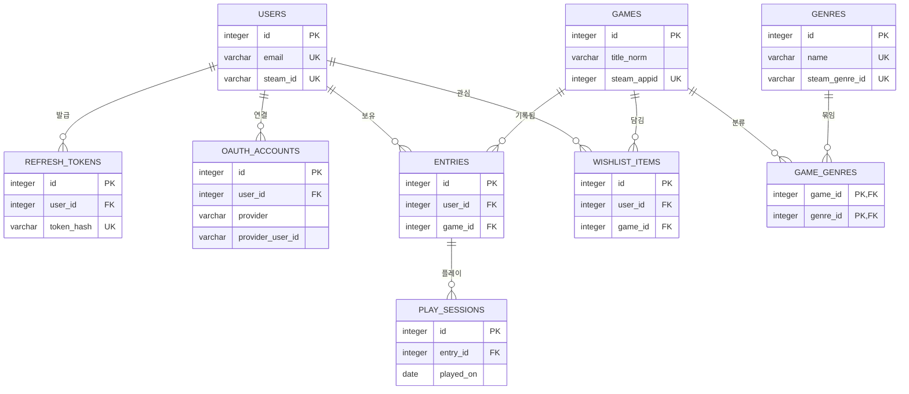

# PlayLedger — 데이터 모델 (ERD)

> 작성일: 2026-08-13 / 개정일: 2026-09-23 / 상태: v1.7
> 관련 문서: 요구사항 정의서(01), 시스템 아키텍처(02)

---

## 1. 전체 구조



> 다이어그램에는 관계 파악에 필요한 키만 표시한다. 전체 컬럼은 2장 표가 기준이다.

### 관계 요약

| 관계 | 종류 | 의미 |
|---|:---:|---|
| USERS → ENTRIES | 1:N | 사용자 1명이 보유 기록 여러 개를 가진다 |
| USERS → WISHLIST_ITEMS | 1:N | 사용자 1명이 관심 게임 여러 개를 가진다 |
| USERS → REFRESH_TOKENS | 1:N | 기기·브라우저마다 로그인 토큰이 따로 발급된다 |
| USERS → OAUTH_ACCOUNTS | 1:N | 외부 로그인 서비스별로 하나씩 연결된다 |
| GAMES → ENTRIES / WISHLIST_ITEMS | 1:N | 게임 1개가 여러 사용자의 기록·위시리스트에 등장한다 |
| GAMES ↔ GENRES | N:M | 게임 1개에 장르 여러 개, 장르 1개에 게임 여러 개 |
| ENTRIES → PLAY_SESSIONS | 1:N | 보유 기록 1개에 날짜별 플레이 기록 여러 개 |

---

## 2. 테이블 상세

### 2.0 공통 규칙

| 항목 | 규칙 | 이유 |
|---|---|---|
| 시각 | `timestamptz` | 시간대 정보를 함께 저장하고, 화면에 표시할 때 한국 시간으로 변환한다 |
| 코드값 | `varchar` + `CHECK` | PostgreSQL ENUM 타입은 값 추가 시 마이그레이션이 번거롭다 |
| 외부 서비스 ID | 문자열 | Steam·Discord ID는 64비트 정수라 JS 숫자로 다루면 끝자리가 깨진다 |
| `updated_at` 갱신 | ORM(SQLAlchemy)에서 처리 | PostgreSQL에는 MariaDB의 `ON UPDATE CURRENT_TIMESTAMP`가 없다 |
| 값 범위 | DB의 `CHECK`로 강제 | 서버 코드를 거치지 않는 경로(직접 SQL 등)로도 잘못된 값이 들어갈 수 없게 한다 |

**외래키 삭제 규칙**

| 부모 삭제 시 | 자식 테이블 | 규칙 |
|---|---|---|
| 사용자 삭제 | `refresh_tokens`, `oauth_accounts`, `entries`, `wishlist_items` | CASCADE (함께 삭제) |
| 보유 기록 삭제 | `play_sessions` | CASCADE |
| 게임 삭제 | `entries`, `wishlist_items` | RESTRICT (참조 중이면 삭제 거부) |
| 게임·장르 삭제 | `game_genres` | CASCADE |

### 2.1 `users`

| 컬럼 | 타입 | 제약 | 설명 |
|---|---|---|---|
| `id` | integer | PK | |
| `email` | varchar(254) | UNIQUE, NULL | 로그인 ID. 저장 전 소문자로 정규화 |
| `password_hash` | varchar(255) | NULL | 해싱된 비밀번호. Discord 전용 계정은 NULL |
| `nickname` | varchar(30) | NOT NULL | 화면 표시 이름 |
| `steam_id` | varchar(20) | UNIQUE, NULL | Steam 64비트 ID. 연결 안 한 사용자는 NULL |
| `created_at` | timestamptz | NOT NULL | 가입 시각 |

`CHECK (password_hash IS NULL OR email IS NOT NULL)`
비밀번호로 로그인하는 계정은 반드시 이메일이 있어야 한다.

**email을 소문자로 정규화하는 이유**

`Test@a.com`과 `test@a.com`이 서로 다른 계정으로 가입되면 안 된다.
`title_norm`과 같은 원리로, 저장 경로와 무관하게 서버가 항상 소문자로 바꿔 저장한다.

**`steam_id`가 UNIQUE인 이유**

두 계정이 같은 Steam ID를 연결하면, 한 사람의 라이브러리가 두 계정에 복제된다.

### 2.2 `refresh_tokens`

| 컬럼 | 타입 | 제약 | 설명 |
|---|---|---|---|
| `id` | integer | PK | |
| `user_id` | integer | FK → users.id, NOT NULL | |
| `token_hash` | char(64) | UNIQUE, NOT NULL | 토큰 원문의 SHA-256 해시 |
| `expires_at` | timestamptz | NOT NULL | 만료 시각 |
| `revoked_at` | timestamptz | NULL | 폐기 시각. NULL이면 유효 |
| `created_at` | timestamptz | NOT NULL | |

**원문이 아니라 해시를 저장하는 이유**

비밀번호와 같다. DB가 유출돼도 해시만으로는 로그인할 수 없다.
요청으로 들어온 토큰을 해싱해서 `token_hash`와 비교한다.

**지우지 않고 `revoked_at`을 기록하는 이유**

rotation으로 폐기된 토큰이 다시 들어온다면, 누군가 옛 토큰을 훔쳐 쓰고 있다는 신호다.
폐기 기록이 남아 있어야 이를 알아채고 해당 사용자의 토큰을 전부 폐기할 수 있다.

### 2.3 `oauth_accounts`

| 컬럼 | 타입 | 제약 | 설명 |
|---|---|---|---|
| `id` | integer | PK | |
| `user_id` | integer | FK → users.id, NOT NULL | |
| `provider` | varchar(20) | NOT NULL, CHECK | `DISCORD` |
| `provider_user_id` | varchar(32) | NOT NULL | 해당 서비스의 사용자 ID |
| `created_at` | timestamptz | NOT NULL | 연결 시각 |

`(provider, provider_user_id)` 복합 UNIQUE — 같은 Discord 계정이 두 사용자에게 연결될 수 없다.
`(user_id, provider)` 복합 UNIQUE — 한 사용자는 서비스별로 계정 하나만 연결한다.

### 2.4 `games`

게임 자체의 정보. **모든 사용자가 공유하는 마스터 데이터**다.
사용자가 몇 명이든 사이버펑크 2077은 이 테이블에 한 행만 존재한다.

| 컬럼 | 타입 | 제약 | 설명 |
|---|---|---|---|
| `id` | integer | PK | |
| `title` | varchar(200) | NOT NULL | 화면에 표시할 제목 |
| `title_norm` | varchar(200) | NOT NULL, INDEX | 정규화된 제목 (중복 판별용, 서버가 항상 계산) |
| `steam_appid` | integer | UNIQUE, NULL | Steam 고유 ID. 수동 등록 게임은 NULL |
| `released_at` | date | NULL | 출시일 |
| `created_at` | timestamptz | NOT NULL | 등록 시각 |

`UNIQUE (title_norm) WHERE steam_appid IS NULL` (부분 UNIQUE)
수동 등록 게임끼리는 정규화된 제목이 겹칠 수 없다. 이유는 아래 "수동 등록 게임에만 UNIQUE를 거는 이유" 참고.

**`title`과 `title_norm`을 나누는 이유**

같은 게임이 여러 표기로 입력될 수 있다.

| 입력값 | `title_norm` |
|---|---|
| `사이버펑크 2077` | `사이버펑크2077` |
| `Cyberpunk 2077` | `cyberpunk2077` |
| `사이버펑크2077` | `사이버펑크2077` |
| `Baldur's Gate 3` | `baldursgate3` |
| `ＦＩＮＡＬ ＦＡＮＴＡＳＹ Ⅶ` | `finalfantasyvii` |

**정규화 규칙**

아래 네 단계를 순서대로 모두 거친다. 앞 단계의 결과가 다음 단계의 입력이 된다.

| 단계 | 처리 | 잡는 것 |
|:---:|---|---|
| 1 | 유니코드 정규화 (NFKC) | 전각 `ＦＦ７` → `FF7`, 로마숫자 기호 `Ⅶ` → `VII`, 분리형 한글 → 조합형 |
| 2 | 대소문자 통일 (`casefold`) | `Gate` / `gate`. `lower()`가 못 잡는 문자(`ß` → `ss`)까지 포함 |
| 3 | 글자 · 숫자만 남김 (`isalnum`) | 공백, `'`, `:`, `®`, `™`, 이모지 등 |
| 4 | 결과 검사 | 빈 문자열이거나 200자를 넘으면 거부 (422) |

4단계가 필요한 이유는 두 가지다. 제목이 `!!!`처럼 기호뿐이면 결과가 빈 문자열이 되어
그런 게임끼리 모두 같은 게임으로 판정된다. 또 1 · 2단계는 글자 수를 늘릴 수 있어(`Ⅶ` → `VII`),
제목이 200자 이내여도 `title_norm`이 컬럼 길이를 넘을 수 있다.

중복 여부는 항상 `title_norm`으로 판별하고, 화면에는 `title`을 보여준다.

> 이 규칙이 잡는 것은 **같은 글자를 다르게 쓴 경우**뿐이다.
> 뜻이 같은 다른 표기(`7` / `VII`, `사이버펑크` / `Cyberpunk`)는 정규화해도 서로 다른 값이 된다.
> 이를 규칙으로 해결하려 하면 `Mega Man X`가 `Mega Man 10`과 합쳐지는 것처럼 다른 게임을 합치는 실수가 생기므로,
> 5장의 별칭 테이블과 `REQUIREMENTS` F-23 · F-30으로 보완한다. (PartScope의 `model_aliases`와 같은 문제)

**중복 판별 순서**

1. `steam_appid`가 있으면 그것으로 비교 (가장 정확)
2. 없으면 수동 등록 게임(`steam_appid IS NULL`) 중에서 `title_norm`으로 비교
3. 둘 다 일치하지 않으면 새 게임으로 등록
4. 3에서 부분 UNIQUE에 걸리면 (같은 제목이 방금 먼저 등록됨) 그 행을 다시 조회해 재사용

판별은 `services`의 게임 조회 함수 한 곳에서만 한다. (`ARCHITECTURE` 2.2절)

**수동 등록 게임에만 UNIQUE를 거는 이유**

조회(2)와 등록(3) 사이에 같은 제목의 요청이 끼어들면, 둘 다 "없음"을 보고 각각 등록해 같은 게임이 두 행이 된다.
`users.email`의 UNIQUE가 회원가입에서 같은 틈을 막는 것과 같은 원리로, DB가 마지막 방어선이 된다.
이 제약은 2단계가 이미 하는 재사용을 동시 요청에서도 지키게 할 뿐, 새로 합쳐지는 게임은 없다.

Steam 게임은 `steam_appid` UNIQUE로 이미 식별되고, appid가 다른데 정규화 제목이 같은 게임(리메이크 등)이 있을 수 있어 제외한다.
`(title_norm, steam_appid)` 복합 UNIQUE로는 막을 수 없다. UNIQUE는 NULL끼리를 서로 다른 값으로 보므로, `steam_appid`가 NULL인 수동 게임끼리는 충돌하지 않는다.
2단계의 조회 범위도 같은 이유로 수동 등록 게임으로 한정한다. 범위가 부분 UNIQUE와 같아 결과는 많아야 한 행이다.
Steam 게임까지 포함하면 같은 제목이 여러 행일 수 있어 어느 것을 쓸지 정할 수 없다. 수동 게임과 Steam 게임의 연결은 M8 동기화에서 다룬다.

### 2.5 `genres` / `game_genres`

장르는 게임과 다대다(N:M) 관계이므로 연결 테이블이 필요하다.

**`genres`**

| 컬럼 | 타입 | 제약 | 설명 |
|---|---|---|---|
| `id` | integer | PK | |
| `name` | varchar(50) | UNIQUE, NOT NULL | 장르명 (Steam 한국어 표기) |
| `steam_genre_id` | varchar(10) | UNIQUE, NOT NULL | Steam 공식 장르 ID |

**장르 목록 (고정)**

| `steam_genre_id` | `name` |
|:---:|---|
| 1 | 액션 |
| 2 | 전략 |
| 3 | RPG |
| 4 | 캐주얼 |
| 9 | 레이싱 |
| 18 | 스포츠 |
| 25 | 어드벤처 |
| 28 | 시뮬레이션 |

> ID와 표기는 Steam 스토어 API(`appdetails`, `l=koreana`)의 응답으로 확인했다 (2026-09-21).

사용자는 이 목록에서 고르기만 하고 새 장르를 만들 수 없다.

**고정 목록인 이유**

`genres`는 모든 사용자가 공유하는 마스터 데이터다. 사용자가 장르를 직접 입력하게 하면
`RPG` / `rpg` / `롤플레잉`이 서로 다른 행으로 쌓여, 장르별 통계(F-11)가 조용히 틀린다.
또 장르가 잘게 쪼개지면 장르마다 게임이 한두 개뿐이라, 게임 하나의 클리어 여부에 따라 완주율이 크게 달라진다.
칸이 적고 고정돼 있어야 통계가 의미를 갖는다.

**Steam 장르 중 8개만 쓰는 이유**

Steam 스토어 장르 중 **게임의 종류**를 나타내는 것만 골랐다.
`인디`(23) · `무료 플레이`(37) · `대규모 멀티플레이어`(29)는 각각 제작 규모 · 가격 모델 · 플레이 방식이라
다른 장르와 전부 겹치고, 해당 장르의 완주율이 무엇을 뜻하는지 불분명해 제외했다.
오픈월드 · 로그라이크 같은 세부 분류는 Steam에서 장르가 아니라 사용자 태그라 포함하지 않는다.

**`steam_genre_id`를 두는 이유**

M8 Steam 동기화 때 Steam 게임에 장르를 자동으로 연결하는 기준이다.
장르 이름은 API 요청 언어에 따라 바뀌지만 ID는 바뀌지 않는다.
문자열인 이유는 Steam API가 `"id": "1"`처럼 문자열로 응답하기 때문이다.
받은 형태 그대로 저장해 비교할 때 변환하지 않는다. (계산에 쓰는 값이 아니다)
NOT NULL로 둬서 "장르는 Steam 장르에서만 온다"는 규칙을 DB가 강제한다.

**목록을 마이그레이션으로 넣는 이유**

장르가 없으면 게임 등록 폼(S-03)의 장르 선택 칩이 비어 기능 일부가 쓸모없어지므로, 테이블과 함께 반드시 존재해야 하는 데이터다.
마이그레이션에 넣으면 `alembic upgrade head` 한 번으로 테이블과 목록이 함께 생겨,
다른 PC · 테스트 DB · CI에서 별도 단계가 필요 없다. 목록을 바꿀 때는 기존 파일을 고치지 않고 새 마이그레이션을 만든다.
M4의 테스트용 게임 데이터는 앱 동작에 필수가 아니므로 별도 스크립트로 넣는다.

**`game_genres`** (연결 테이블)

| 컬럼 | 타입 | 제약 | 설명 |
|---|---|---|---|
| `game_id` | integer | PK, FK → games.id | |
| `genre_id` | integer | PK, FK → genres.id | |

`(game_id, genre_id)`를 복합 기본키로 쓴다. 같은 짝이 두 번 들어갈 수 없고,
연결 테이블에 따로 `id`를 둘 이유가 없다.

**연결 테이블을 쓰는 이유**

`games` 테이블에 `장르1 / 장르2 / 장르3` 컬럼을 두는 방식은
장르 개수가 고정되고, 장르로 검색할 때 모든 컬럼을 뒤져야 한다.
문자열로 `"RPG, 액션"`처럼 이어 붙이면 DB가 이를 데이터로 인식하지 못해
F-11(장르별 통계)을 구현할 수 없다.

**장르 연결 규칙**

`games`는 공유 데이터라, 한 사용자의 입력이 다른 사용자의 장르별 통계를 바꾸면 안 된다.
그래서 장르는 **게임에 연결된 장르가 0개일 때만** 입력값으로 채우고, 이미 있으면 입력을 무시한다.

| 상황 | 동작 |
|---|---|
| 새 게임 | 입력한 장르를 연결 |
| 기존 게임 · 장르 0개 | 입력한 장르를 연결 |
| 기존 게임 · 장르 1개 이상 | 입력을 무시하고, 응답에는 실제 연결된 장르를 담는다 |

- 보유 기록 수정도 같은 규칙을 따른다. 등록 때 장르를 비워둔 게임에 나중에 장르를 붙이는 경로다
- 두 요청이 동시에 "0개"를 보고 각자 채우지 않도록, 장르 수를 세기 전에 게임 행을 잠근다 (`SELECT ... FOR UPDATE`)
- 이미 연결된 장르를 고치거나 빼는 것은 관리자 권한(F-23)에서 다룬다

### 2.6 `entries`

특정 사용자가 특정 게임을 보유한 기록. **이 프로젝트의 중심 테이블**이다.

| 컬럼 | 타입 | 제약 | 설명 |
|---|---|---|---|
| `id` | integer | PK | |
| `user_id` | integer | FK → users.id, NOT NULL | |
| `game_id` | integer | FK → games.id, NOT NULL | |
| `status` | varchar(10) | NOT NULL, CHECK | 진행 상태 (아래 참조) |
| `purchased_at` | date | NULL | 구매일 |
| `purchase_price` | integer | NULL, CHECK ≥ 0 | 구매가 (원) |
| `playtime_minutes` | integer | NOT NULL, 기본 0, CHECK ≥ 0 | 총 플레이타임 (분) |
| `rating` | smallint | NULL, CHECK 1~5 | 평점 |
| `review` | varchar(200) | NULL | 한줄평 |
| `source` | varchar(10) | NOT NULL, CHECK | `MANUAL` / `STEAM` |
| `created_at` | timestamptz | NOT NULL | |
| `updated_at` | timestamptz | NOT NULL | 최종 수정 시각 |

`(user_id, game_id)` 복합 UNIQUE. 같은 사용자가 같은 게임을 두 번 등록할 수 없다.

**`status` 값**

| 값 | 의미 | 백로그 분석 대상 |
|---|---|:---:|
| `BACKLOG` | 미시작 | O |
| `PLAYING` | 플레이중 | X |
| `CLEARED` | 클리어 | X |
| `ON_HOLD` | 보류 | O |
| `DROPPED` | 포기 | X |

`ON_HOLD`와 `DROPPED`를 나누는 이유는 분석 대상이 다르기 때문이다.
보류는 돌아올 가능성이 있으니 백로그에 포함하고, 포기는 이미 끝난 것으로 본다.

**`source`가 필요한 이유**

M8에서 Steam 동기화를 실행할 때, 사용자가 직접 수정한 값을
API 응답이 덮어쓰면 안 된다. 동기화 규칙:

- `source = 'STEAM'` → 플레이타임을 API 값으로 갱신
- `source = 'MANUAL'` → 건드리지 않음
- 구매가, 평점, 한줄평은 Steam에 없는 정보이므로 항상 보존

이 컬럼 하나가 "자동 수집 데이터와 수동 데이터의 충돌"이라는 문제 전체를 해결한다.

**보유 기록의 `game_id`는 바꾸지 않는다**

제목을 바꾸는 것은 이 기록이 가리키는 게임을 갈아끼우는 것이다.
그러면 이 기록에 쌓인 플레이타임 · 평점 · (v2.0의) 플레이 세션이 엉뚱한 게임에 붙는다.
수정 API는 `game_id`를 바꾸지 않으며, 제목을 보내면 422로 거절한다.
잘못 등록한 게임은 삭제 후 다시 등록한다.

**타입 선택 근거**

| 컬럼 | 선택 | 이유 |
|---|---|---|
| `playtime_minutes` | 분 단위 정수 | Steam은 분 단위로 응답한다. 시간 단위 소수로 반올림하면 동기화 증가분(세션)을 계산할 때 오차가 누적된다. 화면에는 시간으로 변환해 표시한다 |
| `purchase_price` | integer | 원 단위 정수. 소수점이 필요 없다 |
| `rating` | NULL 허용 | 미평가와 0점은 다르다. 평균 계산 시 NULL은 제외된다 |
| `purchased_at` | NULL 허용 | Steam 동기화로 들어온 게임은 구매일을 알 수 없다 |

> v0에서는 `playtime_hours decimal(6,1)`이었다. 세션 기록(F-20)이 생기면서
> 증가분 계산의 정확도가 중요해져 분 단위 정수로 변경했다.

### 2.7 `wishlist_items`

| 컬럼 | 타입 | 제약 | 설명 |
|---|---|---|---|
| `id` | integer | PK | |
| `user_id` | integer | FK → users.id, NOT NULL | |
| `game_id` | integer | FK → games.id, NOT NULL | |
| `memo` | varchar(200) | NULL | 사고 싶은 이유 등 |
| `created_at` | timestamptz | NOT NULL | 담은 시각 |

`(user_id, game_id)` 복합 UNIQUE.

**`games`를 참조하는 이유**

위시리스트 게임도 장르 정보가 있어야 구매 전 경고(F-18)를 계산할 수 있다.
게임 정보를 따로 저장하지 않고 `games` 마스터를 그대로 재사용한다.

**구매 전환은 트랜잭션으로 처리한다**

`entries`에 추가하는 것과 `wishlist_items`에서 삭제하는 것은 반드시 함께 일어나야 한다.
하나만 성공하면 같은 게임이 양쪽에 동시에 존재하게 된다.

### 2.8 `play_sessions`

| 컬럼 | 타입 | 제약 | 설명 |
|---|---|---|---|
| `id` | integer | PK | |
| `entry_id` | integer | FK → entries.id, NOT NULL | |
| `played_on` | date | NOT NULL | 플레이한 날짜 (한국 시간 기준) |
| `minutes` | integer | NOT NULL, CHECK > 0 | 그날 플레이한 시간 (분) |
| `created_at` | timestamptz | NOT NULL | |

`(entry_id, played_on)` 복합 UNIQUE. 한 게임은 하루에 한 행만 가지고,
같은 날 추가 기록은 기존 행에 합산한다 (3.6절).

**`user_id`와 `source` 컬럼이 없는 이유**

둘 다 `entries`를 따라가면 알 수 있다. 같은 정보를 두 곳에 저장하면
한쪽만 바뀌었을 때 서로 어긋난다. 세션의 출처는 항상 소속된 `entries.source`를 따른다.

---

## 3. 주요 조회 패턴

### 3.1 목록 조회 (F-03)

```sql
SELECT g.title, e.status, e.playtime_minutes, e.purchase_price
FROM entries e
JOIN games g ON g.id = e.game_id
WHERE e.user_id = :user_id
ORDER BY e.updated_at DESC;
```

### 3.2 방치 게임 추출 (F-09)

```sql
SELECT g.title, CURRENT_DATE - e.purchased_at AS idle_days
FROM entries e
JOIN games g ON g.id = e.game_id
WHERE e.user_id = :user_id
  AND e.status = 'BACKLOG'
  AND e.purchased_at IS NOT NULL
ORDER BY idle_days DESC;
```

PostgreSQL은 날짜끼리 빼면 바로 일수(정수)가 나온다. MariaDB의 `DATEDIFF()`에 해당한다.

### 3.3 장르별 통계 (F-11)

```sql
SELECT gn.name,
       COUNT(*)                                     AS total,
       COUNT(*) FILTER (WHERE e.status = 'CLEARED')  AS cleared,
       COUNT(*) FILTER (WHERE e.status <> 'BACKLOG') AS started
FROM entries e
JOIN game_genres gg ON gg.game_id = e.game_id
JOIN genres gn      ON gn.id = gg.genre_id
WHERE e.user_id = :user_id
GROUP BY gn.id;
```

완주율 = `cleared ÷ started` (`REQUIREMENTS` 5.3절 정의대로 분모에서 미시작 제외). 계산은 `services`에서 한다.

### 3.4 구매 전 경고 (F-18)

위시리스트 게임의 장르마다, 내가 그 장르를 얼마나 쌓아두고 끝냈는지 조회한다.

```sql
SELECT gn.name,
       COUNT(*) FILTER (WHERE e.status = 'BACKLOG')  AS backlog,
       COUNT(*) FILTER (WHERE e.status = 'CLEARED')  AS cleared,
       COUNT(*) FILTER (WHERE e.status <> 'BACKLOG') AS started
FROM game_genres target
JOIN genres gn      ON gn.id = target.genre_id
JOIN game_genres gg ON gg.genre_id = target.genre_id
JOIN entries e      ON e.game_id = gg.game_id
                   AND e.user_id = :user_id
WHERE target.game_id = :wish_game_id
GROUP BY gn.id;
```

### 3.5 활동 히트맵 (F-20)

```sql
SELECT ps.played_on, SUM(ps.minutes) AS minutes
FROM play_sessions ps
JOIN entries e ON e.id = ps.entry_id
WHERE e.user_id = :user_id
  AND ps.played_on > CURRENT_DATE - 365
GROUP BY ps.played_on
ORDER BY ps.played_on;
```

세션에는 `user_id`가 없으므로 `entries`를 거쳐 사용자를 격리한다.

### 3.6 세션 기록 (같은 날 합산)

```sql
INSERT INTO play_sessions (entry_id, played_on, minutes)
VALUES (:entry_id, :today, :delta)
ON CONFLICT (entry_id, played_on)
DO UPDATE SET minutes = play_sessions.minutes + EXCLUDED.minutes;
```

같은 날 행이 없으면 새로 만들고, 있으면 기존 값에 더한다 (upsert).
하루에 수동 동기화와 자동 동기화가 모두 실행돼도 행이 늘어나지 않는다.

---

## 4. 인덱스 계획

| 테이블 | 컬럼 | 목적 |
|---|---|---|
| `entries` | `(user_id, status)` | 상태별 필터링이 가장 잦은 조회 |
| `entries` | `(user_id, game_id)` UNIQUE | 중복 등록 방지 겸 사용자별 조회 |
| `games` | `title_norm` | 중복 판별 시 매번 조회 |
| `games` | `title_norm` UNIQUE (`steam_appid IS NULL`인 행만) | 수동 등록 게임의 동시 등록 중복 방지 (2.4절) |
| `games` | `steam_appid` UNIQUE | 동기화 시 조회 |
| `genres` | `steam_genre_id` UNIQUE | 동기화 시 Steam 장르 ID로 조회 |
| `game_genres` | `genre_id` | 구매 전 경고(3.4절)에서 장르로 게임 찾기 |
| `refresh_tokens` | `user_id` | 사용자 토큰 전체 폐기 |
| `play_sessions` | `(entry_id, played_on)` UNIQUE | upsert 충돌 판정 겸 히트맵 조회 |

**PostgreSQL은 외래키에 인덱스를 자동으로 만들지 않는다.**
MariaDB(InnoDB)는 자동으로 만들어줬지만, PostgreSQL에서는 필요한 곳에 직접 만들어야 한다.

**`game_genres`에 `genre_id` 인덱스가 따로 필요한 이유**

복합 기본키 `(game_id, genre_id)`는 `game_id`로 시작하는 조회에만 쓰인다.
`genre_id`만으로 찾는 조회는 이 순서를 활용할 수 없다.

> PK·UNIQUE 인덱스는 자동으로 생성된다. 나머지는 M4 이후 측정해보고 추가를 결정한다.

---

## 5. 확장 여지

- **게임 별칭** — 뜻이 같은 다른 표기(한글 · 영문, `7` / `VII`)를 같은 게임으로 묶는 `game_aliases` 테이블 (2.4절)
- **비슷한 게임 후보 제시 (F-30)** — PostgreSQL `pg_trgm` 확장으로 제목 유사도를 계산해 등록 시 후보로 보여준다. 자동 병합은 하지 않는다
- **관리자 권한 (F-23)** — `users`에 역할 컬럼 추가
- **커버 아트 (F-22)** — `steam_appid`로 이미지 주소를 계산할 수 있어 컬럼 추가 불필요
- **외부 로그인 추가** — `oauth_accounts.provider`의 허용값만 추가

---

## 변경 이력

| 버전 | 날짜 | 내용 |
|---|---|---|
| v0.1 | 2026-08-13 | 최초 작성 |
| v0.2 | 2026-08-17 | `entries.playtime_hours` 타입을 실제 구현(`models.py`) 기준으로 decimal(7,1) → decimal(6,1) 정정. max_digits=6, decimal_places=1로는 최대 99999.9시간까지 표현 가능해 실사용 범위를 충분히 커버하므로 코드가 아닌 문서를 실물에 맞춤 |
| v1.0 | 2026-09-18 | 스택 전환(MariaDB → PostgreSQL)에 따른 전면 개정. 파일명 `ERD.md` → `03_erd.md`. `refresh_tokens`·`oauth_accounts`·`wishlist_items`·`play_sessions` 추가, 로그인 ID를 email로 변경, `playtime_hours`(decimal) → `playtime_minutes`(integer), 공통 규칙(2.0)과 외래키 삭제 규칙 신설, 조회 쿼리를 PostgreSQL 문법으로 변경. 개정 전 문서는 `v0-rn-django` 태그 참고 |
| v1.1 | 2026-09-21 | 2.5절 `genres`에 `steam_genre_id`(UNIQUE, NOT NULL) 추가, 장르 목록(Steam 공식 장르 8개) · 선정 기준 · 시드 방식 명시. `REQUIREMENTS` 10장 "장르 데이터 출처" 결정 반영. 사유는 `DEVLOG` 2026-09-21 결정 기록 참고 |
| v1.2 | 2026-09-21 | 2.4절 정규화 규칙을 구현 가능한 수준으로 구체화 (NFKC → casefold → 글자 · 숫자만 남김 → 빈 값 · 길이 검사), 예시 추가, 정규화가 잡지 못하는 경우와 보완책 명시, 중복 판별 입구를 하나로 명시. 5장에 F-30 추가. 기존 규칙("공백 제거 → 소문자 → 특수문자 제거")은 "특수문자"의 범위가 정해지지 않아 코드로 옮길 수 없었음 |
| v1.3 | 2026-09-21 | 2.4절 `games`에 부분 UNIQUE `(title_norm) WHERE steam_appid IS NULL` 추가, 중복 판별 4단계(UNIQUE 충돌 시 재조회) 및 근거 명시. 4장 인덱스 표 반영. 조회와 등록 사이의 동시 요청으로 수동 게임이 중복 등록되는 틈을 DB에서 막기 위함 |
| v1.4 | 2026-09-22 | 2.4절 판별 2단계의 조회 범위를 수동 등록 게임(`steam_appid IS NULL`)으로 명시. 범위를 부분 UNIQUE와 일치시켜 조회 결과가 한 행을 넘지 않게 함. 수동 · Steam 게임 연결은 M8로 미룸 |
| v1.5 | 2026-09-22 | 문서 참조 표기를 번호에서 문서 이름 기준으로 통일(예: "01~05 문서" → `REQUIREMENTS` · `ARCHITECTURE` · `ERD` · `UI_DESIGN` · `MILESTONES`. 내용 변경 없음) |
| v1.6 | 2026-09-22 | 2.5절에 장르 연결 규칙 추가 — 게임에 장르가 0개일 때만 입력값으로 채우고, 이미 있으면 무시. 동시 요청 대비 게임 행 잠금. 공유 데이터인 `games`의 장르를 한 사용자가 덮어쓰거나 덧붙여 다른 사용자의 통계가 바뀌는 것을 막기 위함. 사유는 `DEVLOG` 2026-09-22 결정 기록 참고 |
| v1.7 | 2026-09-23 | 2.6절에 보유 기록의 `game_id`를 수정하지 않는다는 규칙 추가 — 게임을 갈아끼우면 그 기록에 쌓인 플레이타임 · 평점 · 플레이 세션이 다른 게임에 붙는다. 사유는 `DEVLOG` 2026-09-23 결정 기록 참고 |
