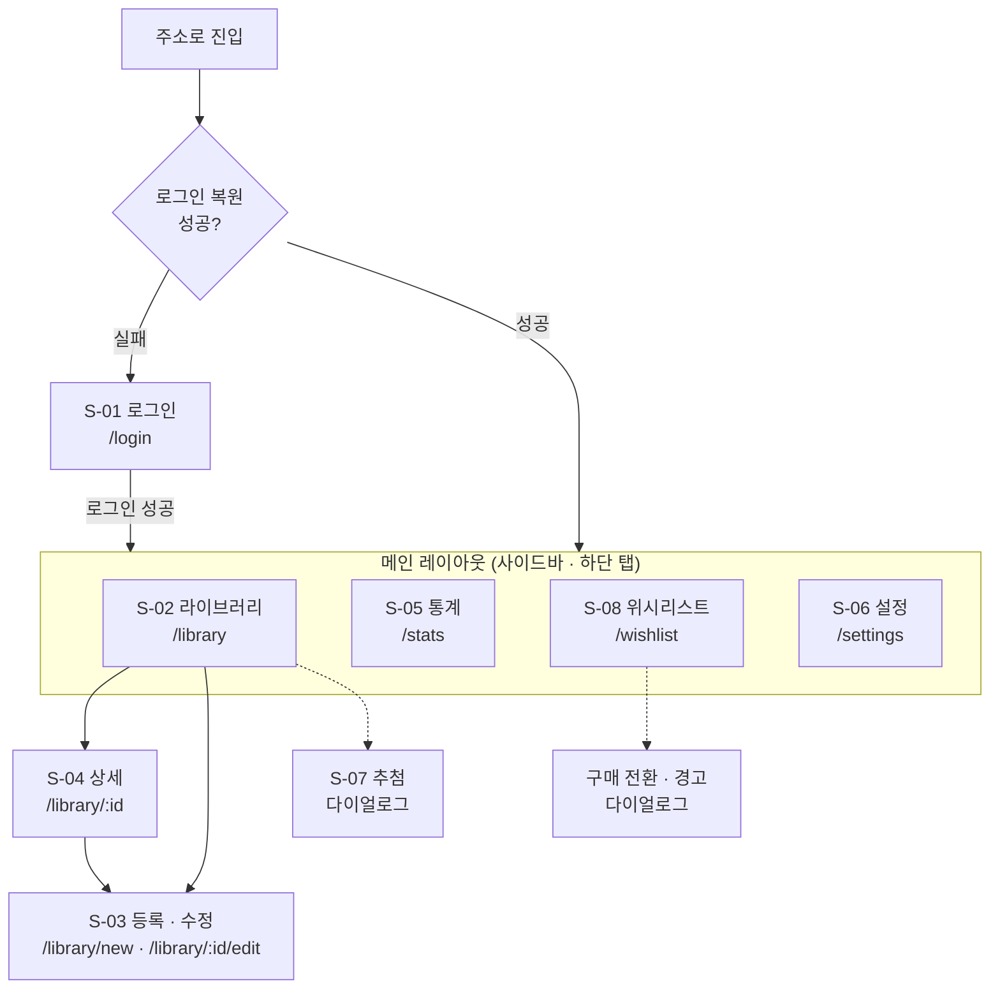
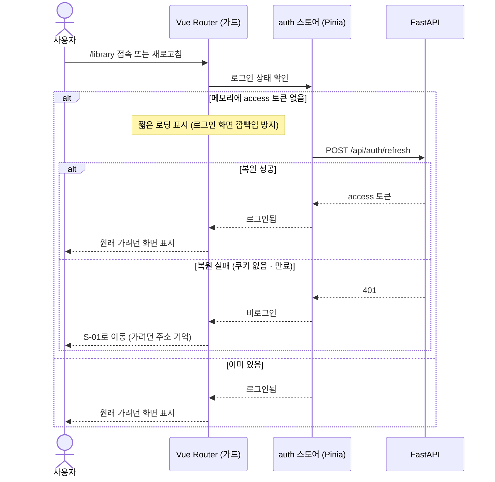
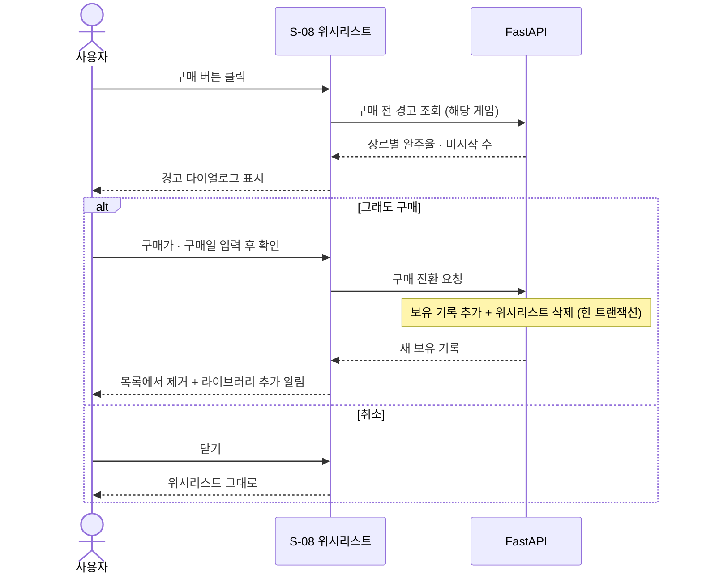
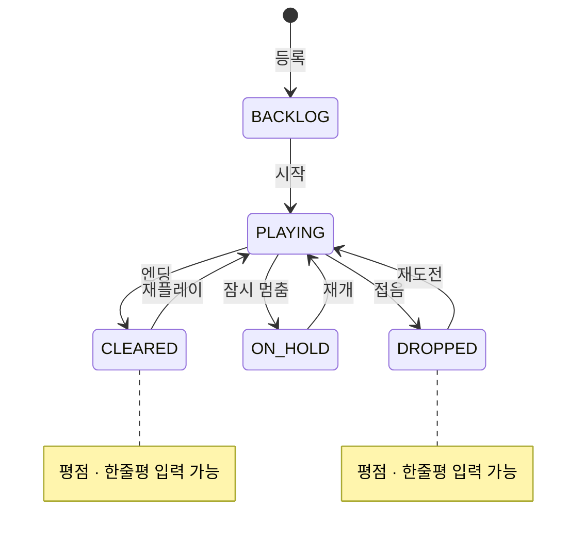

# PlayLedger — 화면 설계서

> 웹 화면 구성 및 UI 동작 규격 정의

- **작성일**: 2026-08-13
- **개정일**: 2026-09-21
- **작성자**: 사공민규
- **버전**: v1.1
- **관련 문서**: 요구사항 정의서(01), 시스템 아키텍처(02), 데이터 모델(03)

---

## 1. 화면 목록

| ID | 화면명 | 마일스톤 | 버전 | 형태 | 설명 |
|---|---|:---:|:---:|---|---|
| S-01 | 로그인 · 가입 | M2 | v1.0 | 페이지 | 로그인 / 회원가입 전환 |
| S-02 | 라이브러리 | M2 | v1.0 | 페이지 | 보유 게임 목록 (홈) |
| S-03 | 게임 등록 · 수정 | M2 | v1.0 | 페이지 | 게임 정보 입력 폼 |
| S-04 | 게임 상세 | M3 | v1.0 | 페이지 | 단일 게임 정보 + 상태 변경 |
| S-05 | 통계 | M4 | v1.0 | 페이지 | 백로그 대시보드 (v2.0에 히트맵 추가) |
| S-06 | 설정 | M2 | v1.0 | 페이지 | 로그아웃 (M8에 Steam, M11에 Discord 추가) |
| S-07 | 다음 게임 추첨 | M6 | v1.1 | 다이얼로그 | 룰렛으로 미시작 게임 1개 제안 |
| S-08 | 위시리스트 | M7 | v1.2 | 페이지 | 관심 게임 관리 + 구매 전환 |

**페이지와 다이얼로그를 나누는 기준**

입력 항목이 많거나 주소로 다시 찾아올 만한 화면은 페이지로 만든다.
짧은 확인·선택처럼 현재 화면 위에서 끝나는 작업은 다이얼로그로 띄운다.

---

## 2. 네비게이션 구조

### 2.1 화면 이동 흐름



> 실선은 페이지 이동, 점선은 현재 화면 위에 뜨는 다이얼로그다.

**S-03, S-04를 메뉴에 넣지 않는 이유**

이 둘은 "특정 게임"에 종속된 화면이라 메뉴의 다른 항목과 대등하지 않다.
주소도 `/library` 아래에 두어 라이브러리의 하위 화면임을 드러낸다.

**화면 상태를 주소에 담는다**

필터와 정렬은 `/library?status=BACKLOG&sort=idle`처럼 주소에 반영한다.
새로고침하거나 뒤로가기를 해도 보던 화면이 그대로 유지되고,
주소를 즐겨찾기해두면 "방치된 게임 목록"으로 바로 들어올 수 있다.

### 2.2 레이아웃

```
[데스크톱 · 768px 이상]
┌─────────────┬────────────────────────────────┐
│ PlayLedger  │  화면 제목              [동작 버튼]│
│             ├────────────────────────────────┤
│ ▸ 라이브러리  │                                │
│   통계       │          각 화면 본문            │
│   위시리스트  │                                │
│   설정       │                                │
└─────────────┴────────────────────────────────┘

[모바일 · 768px 미만]
┌──────────────────────┐
│ 화면 제목    [동작 버튼] │
├──────────────────────┤
│                      │
│      각 화면 본문      │
│                      │
├──────────────────────┤
│ 라이브러리 통계 위시 설정 │
└──────────────────────┘
```

| 화면 폭 | 메뉴 위치 | 이유 |
|---|---|---|
| 768px 이상 | 왼쪽 사이드바 | 가로 공간이 넉넉하고, 메뉴가 항상 보여 이동이 한 번에 끝난다 |
| 768px 미만 | 하단 탭 | 한 손으로 쥐었을 때 엄지가 가장 쉽게 닿는 곳이 화면 아래쪽이다 |

3장의 와이어프레임은 화면에 **무엇이 어떤 순서로** 들어가는지를 나타낸다.
실제 배치는 폭에 따라 달라지며, 모바일 폭 기준으로 그렸다.

### 2.3 앱 진입 시 로그인 복원



토큰 발급 원리는 02 문서 4.1절을 따른다. 이 절은 그동안 **화면이 어떻게 보이는지**만 정한다.

**복원이 끝날 때까지 로딩을 보여주는 이유**

복원 결과를 기다리지 않고 바로 판단하면, 로그인된 사용자에게도
로그인 화면이 0.5초쯤 번쩍 보였다가 라이브러리로 넘어간다.

**가려던 주소를 기억하는 이유**

즐겨찾기로 `/library?status=BACKLOG`에 들어왔다가 로그인 화면으로 밀려났다면,
로그인 후 홈이 아니라 원래 보려던 목록으로 돌아가야 한다.

---

## 3. 화면별 상세

### 3.1 S-01 로그인

```
┌──────────────────────────┐
│                          │
│                          │
│       PlayLedger         │
│   사놓고 안 한 게임, 관리    │
│                          │
│  ┌────────────────────┐  │
│  │ email              │  │
│  └────────────────────┘  │
│  ┌────────────────────┐  │
│  │ Password           │  │
│  └────────────────────┘  │
│                          │
│  ┌────────────────────┐  │
│  │       Login        │  │
│  └────────────────────┘  │
│                          │
│    계정이 없으신가요? 가입    │
│                          │
└──────────────────────────┘
```

| 항목 | 규격 |
|---|---|
| 입력 검증 | 빈 값이면 버튼 비활성. 서버 응답 전 중복 제출 차단 |
| 실패 표시 | 입력 필드 아래 빨간 텍스트. 알림창 사용 안 함 |
| 로그인 유지 | refresh 쿠키로 자동 복원 (2.3절). 기기에 토큰을 직접 저장하지 않음 |
| 가입 전환 | 같은 화면에서 폼만 전환 (닉네임 필드 추가) |
| Discord 로그인 (M11) | 폼 아래 `Discord로 계속하기` 버튼 추가 |

> **실패 메시지 원칙:** "가입되지 않은 이메일입니다" / "비밀번호가 틀렸습니다"로
> 나누지 않고 "이메일 또는 비밀번호가 올바르지 않습니다"로 통일한다.
> 나누면 어떤 이메일이 가입되어 있는지 알려주는 셈이 된다.

---

### 3.2 S-02 라이브러리 (홈)

```
┌──────────────────────────┐
│ 라이브러리    [🎲] [ + ]   │  ← 헤더
├──────────────────────────┤
│ [전체] [미시작] [플레이중]   │  ← 상태 필터 (가로 스크롤)
│ [클리어] [보류] [포기]      │
├──────────────────────────┤
│ 총 42개 · 미시작 18개       │  ← 요약 줄
├──────────────────────────┤
│ ┌──────────────────────┐ │
│ │ 사이버펑크 2077        │ │
│ │ ● 클리어  ·  62.4시간  │ │
│ │ RPG                  │ │
│ └──────────────────────┘ │
│ ┌──────────────────────┐ │
│ │ 발더스 게이트 3         │ │
│ │ ● 미시작  ·  방치 214일 │ │
│ │ RPG                  │ │
│ └──────────────────────┘ │
│           ⋮              │
└──────────────────────────┘
```

| 항목 | 규격 |
|---|---|
| 정렬 기본값 | 최근 수정순 |
| 정렬 옵션 | 최근 수정 / 구매일 / 제목 / 플레이타임 |
| 목록 로딩 | 20개씩. 끝에 도달하면 추가 로드 |
| 카드 탭 | S-04 상세로 이동 |
| `+` 버튼 | S-03 등록으로 이동 |
| 필터 · 정렬 | 주소 쿼리에 반영 (2.1절) |
| `🎲` 버튼 | S-07 추첨 다이얼로그 (v1.1) |

**카드 두 번째 줄이 상태에 따라 바뀐다**

| 상태 | 표시 내용 |
|---|---|
| `BACKLOG` | `● 미시작 · 방치 214일` |
| `PLAYING` | `● 플레이중 · 12.5시간` |
| `CLEARED` | `● 클리어 · 62.4시간` |
| `ON_HOLD` | `● 보류 · 8.0시간` |
| `DROPPED` | `● 포기 · 1.2시간` |

미시작 게임에 플레이타임(0시간)을 보여주는 것은 정보가 아니다.
그 자리에 방치일수를 넣으면 이 앱이 풀려는 문제가 목록에서 바로 보인다.
플레이타임은 서버에서 분 단위로 받고, 화면에서 시간 단위(소수점 한 자리)로 변환해 표시한다.

---

### 3.3 S-03 게임 등록·수정

```
┌──────────────────────────┐
│ ← 게임 등록         [저장] │
├──────────────────────────┤
│ 제목 *                    │
│ ┌──────────────────────┐ │
│ │                      │ │
│ └──────────────────────┘ │
│                          │
│ 상태 *                    │
│ [미시작▾]                 │
│                          │
│ 장르                      │
│ [+ RPG] [+ 액션] [+ ...]  │  ← 다중 선택 칩
│                          │
│ 구매일                    │
│ [2026-01-15]             │
│                          │
│ 구매가 (원)                │
│ ┌──────────────────────┐ │
│ └──────────────────────┘ │
│                          │
│ 플레이타임 (시간)           │
│ ┌──────────────────────┐ │
│ └──────────────────────┘ │
│                          │
│ ── 클리어/포기 시에만 표시 ── │
│ 평점  ☆☆☆☆☆            │
│ 한줄평                    │
│ ┌──────────────────────┐ │
│ └──────────────────────┘ │
└──────────────────────────┘
```

| 항목 | 규격 |
|---|---|
| 필수 항목 | 제목, 상태. 나머지는 선택 |
| 조건부 표시 | 평점·한줄평은 상태가 `CLEARED` 또는 `DROPPED`일 때만 노출 |
| 중복 경고 | 저장 시 서버가 중복으로 판정하면 "이미 등록된 게임입니다" 표시 |
| 수정 모드 | 같은 화면 재사용 (/library/:id/edit). 기존 값 채워서 진입 |
| 플레이타임 입력 | 시간 단위로 입력받고, 서버에는 분 단위로 변환해 보낸다 |

**평점을 조건부로 숨기는 이유**

아직 시작도 안 한 게임에 평점 칸이 보이면 뭘 적어야 하나 고민하게 된다.
입력할 수 없는 항목은 보이지 않는 편이 낫다.

---

### 3.4 S-04 게임 상세

```
┌──────────────────────────┐
│ ←              [수정][⋮]  │
├──────────────────────────┤
│ 사이버펑크 2077            │
│ RPG                      │
│                          │
│ ┌──────────────────────┐ │
│ │ 상태   [클리어 ▾]      │ │  ← 여기서 바로 변경
│ └──────────────────────┘ │
│                          │
│ 구매일        2026-01-15  │
│ 구매가          66,000원   │
│ 플레이타임        62.4시간  │
│ ───────────────────────  │
│ 시간당 비용     1,058원/h   │  ← 서버 계산값
│ ───────────────────────  │
│ 평점            ★★★★☆ │
│ 한줄평                    │
│ "엔딩 보고 한참 멍했음"      │
│ ───────────────────────  │
│ 플레이 기록 (v2.0)  [+ 추가] │
│ 09-17   2시간 10분         │
│ 09-15   45분              │
│                          │
│ 출처              직접 입력 │
└──────────────────────────┘
```

| 항목 | 규격 |
|---|---|
| 상태 변경 | 상세 화면에서 바로 변경 (수정 화면 안 거침) |
| 시간당 비용 | 플레이타임 0이면 `—` 표시 |
| `⋮` 메뉴 | 삭제 (확인 대화상자 필수) |
| 출처 표시 | `직접 입력` / `Steam 연동` |
| 상태 전환 | 4.3절 상태 흐름 참고. 드롭다운으로는 어떤 상태로든 직접 변경 가능 |
| 플레이 기록 (v2.0) | 최근 세션 5개 표시. 수동 등록 게임만 `+ 추가` 버튼 노출 (Steam 게임은 자동 생성) |

**상태만 별도로 변경할 수 있게 하는 이유**

가장 자주 하는 조작이 "미시작 → 플레이중" 전환이다.
이걸 수정 화면 진입 → 항목 찾기 → 저장의 3단계로 만들면 안 쓰게 된다.

---

### 3.5 S-05 통계

```
┌──────────────────────────┐
│ 통계                      │
├──────────────────────────┤
│ ┌────────┐ ┌────────┐    │
│ │  42    │ │  18    │    │
│ │ 총 보유  │ │ 미시작  │    │
│ └────────┘ └────────┘    │
│ ┌────────┐ ┌────────┐    │
│ │ 31.0%  │ │ 42.9%  │    │
│ │ 사장률   │ │ 완주율  │    │
│ └────────┘ └────────┘    │
├──────────────────────────┤
│ 오래 방치된 게임             │
│ 1. 발더스 게이트 3   214일   │
│ 2. 엘든 링          180일   │
│ 3. 데스 스트랜딩     156일   │
│                 [더보기]   │
├──────────────────────────┤
│ 시간당 비용이 높은 게임       │
│ 1. 게임 A      33,000원/h  │
│ 2. 게임 B      12,400원/h  │
├──────────────────────────┤
│ 장르별 완주율               │
│ RPG      ▓▓▓▓▓░░░░  52%  │
│ 액션      ▓▓▓░░░░░░  31%  │
│ 전략      ▓░░░░░░░░  12%  │
├──────────────────────────┤
│ 플레이 활동 (v2.0)         │
│ (최근 1년 캘린더 히트맵)     │
└──────────────────────────┘
```

| 항목 | 규격 |
|---|---|
| 계산 주체 | 전부 서버. 화면은 받은 값을 표시만 |
| 갱신 시점 | 화면 진입 시마다 조회 |
| 목록 항목 수 | 기본 3개, 더보기로 확장 |
| 차트 | 장르별 완주율은 ECharts 막대 차트 |
| 플레이 활동 (v2.0) | 최근 1년 캘린더 히트맵. 칸 색이 진할수록 그날 플레이 시간이 많음 |

---

### 3.6 S-06 설정

```
┌──────────────────────────┐
│ 설정                      │
├──────────────────────────┤
│ 계정                      │
│   사공민규                 │
│   sagming40@example.com  │
├──────────────────────────┤
│ Steam 연동 (M8)           │
│   Steam ID               │
│   ┌────────────────────┐ │
│   │ 7656119...         │ │
│   └────────────────────┘ │
│   ┌────────────────────┐ │
│   │   지금 동기화        │ │
│   └────────────────────┘ │
│   마지막 동기화: 2시간 전    │
├──────────────────────────┤
│ Discord 연결 (M11)        │
│   [ Discord 계정 연결 ]    │
├──────────────────────────┤
│   로그아웃                 │
└──────────────────────────┘
```

**동기화 결과 표시**

동기화 후 "추가 12개 · 갱신 30개 · 변경 없음 5개"처럼 요약을 보여준다.
"완료되었습니다"만 뜨면 뭐가 바뀌었는지 알 수 없어 불안하다.

**Steam 프로필 공개 안내**

Steam ID 입력란 아래에 "Steam 프로필의 게임 세부 정보가 공개여야 동기화됩니다"를
항상 표시한다. 비공개 상태에서 동기화하면 실패 원인을 오류 메시지로 명확히 알려준다. (01 문서 R-01)

---

### 3.7 S-07 다음 게임 추첨 (v1.1)

```
┌──────────────────────────┐
│  오늘은 뭐 할까?        [×] │
├──────────────────────────┤
│                          │
│    ┌──────────────────┐  │
│    │   발더스 게이트 3   │  │  ← 회전하다 멈춤
│    │   RPG · 방치 214일 │  │
│    └──────────────────┘  │
│                          │
│  [ 다시 돌리기 ] [ 이걸로! ] │
└──────────────────────────┘
```

| 항목 | 규격 |
|---|---|
| 추첨 대상 | 상태가 `BACKLOG`인 게임 |
| 추첨 주체 | **서버가 결과를 먼저 고르고**, 화면은 그 결과에서 멈추도록 연출만 한다 |
| 연출 | Motion으로 카드가 2~3초간 빠르게 넘어가다 감속하며 멈춤 |
| `이걸로!` | 해당 게임 상태를 `PLAYING`으로 바꾸고 S-04로 이동 |
| 대상 없음 | 버튼 비활성 + "미시작 게임이 없어요" 안내 |
| 동작 줄이기 | OS의 "동작 줄이기" 설정이 켜져 있으면 회전 없이 결과만 표시 |

**결과를 서버가 고르는 이유**

애니메이션이 돌아가는 동안 결과가 정해지지 않은 게 아니라, 이미 정해진 결과를
극적으로 보여주는 것이다. 무엇을 고를지는 판단이므로 서버가 한다.

---

### 3.8 S-08 위시리스트 (v1.2)

```
┌──────────────────────────┐
│ 위시리스트           [ + ] │
├──────────────────────────┤
│ ┌──────────────────────┐ │
│ │ 엘든 링 DLC      ⚠ 주의 │ │
│ │ RPG · "세일 때 사자"    │ │
│ │              [ 구매 ] │ │
│ └──────────────────────┘ │
│ ┌──────────────────────┐ │
│ │ 하데스 2               │ │
│ │ 액션                  │ │
│ │              [ 구매 ] │ │
│ └──────────────────────┘ │
└──────────────────────────┘
```

| 항목 | 규격 |
|---|---|
| 추가 | 제목 · 장르 · 메모만 입력 (구매가 · 구매일 없음) |
| 경고 배지 | 해당 장르의 완주율이 낮거나 미시작 게임이 많으면 `⚠ 주의` 표시 |
| 경고 기준 | 초기값: 장르 완주율 30% 미만 또는 같은 장르 미시작 5개 이상 (사용해보며 조정) |
| `구매` | 경고 다이얼로그 → 구매가 · 구매일 입력 → 라이브러리로 전환 |

**구매 전환 흐름**



**경고는 구매를 막지 않는다**

경고 다이얼로그는 숫자를 보여줄 뿐 구매 버튼을 비활성화하지 않는다.
01 문서 5.4절대로, 지표는 판단 보조이고 결정은 사람이 한다.

---

## 4. 상태 표시 규칙

### 4.1 진행 상태 색상

| 상태 | 색상 계열 | 비고 |
|---|---|---|
| `BACKLOG` | 회색 | 아직 시작 안 함 |
| `PLAYING` | 파랑 | 진행 중 |
| `CLEARED` | 초록 | 완료 |
| `ON_HOLD` | 노랑 | 멈춤 |
| `DROPPED` | 흐린 회색 | 종료 |

**색만으로 구분하지 않는다.** 모든 상태 표시는 색과 텍스트를 함께 쓴다.
색각 이상이 있는 사용자도 구분할 수 있어야 한다.

### 4.2 방치일수 강조

| 구간 | 표시 |
|---|---|
| 30일 미만 | 기본 |
| 30 ~ 179일 | 강조 없음, 일수만 표시 |
| 180일 이상 | 주의 색상 |

### 4.3 상태 전환 흐름



> 대표적인 흐름이다. 실제로는 어떤 상태에서든 다른 상태로 직접 변경할 수 있다.

**평점이 있는 상태에서 벗어날 때**

`CLEARED`에서 `PLAYING`으로 바꿔도(재플레이) 평점과 한줄평은 지우지 않고 숨기기만 한다.
다시 `CLEARED`로 돌아오면 이전 평점이 채워진 채로 나타난다.

---

## 5. 빈 상태 (Empty State)

신규 가입자는 데이터가 하나도 없다. 이 상태를 방치하면
"앱이 고장 났나" 싶은 화면이 된다.

| 화면 | 빈 상태 처리 |
|---|---|
| S-02 라이브러리 | "아직 등록된 게임이 없어요" + `게임 추가하기` 버튼 |
| S-02 필터 결과 없음 | "해당 상태의 게임이 없습니다" (버튼 없음) |
| S-05 통계 | "게임을 등록하면 통계가 표시됩니다" |
| S-05 플레이 활동 (v2.0) | "플레이 기록이 쌓이면 여기에 표시됩니다" |
| S-07 추첨 | 대상 없음 → 버튼 비활성 + 안내 (3.7절) |
| S-08 위시리스트 | "사고 싶은 게임을 담아두세요" + `게임 담기` 버튼 |

전체가 비었을 때와 필터 결과만 비었을 때는 다르게 처리한다.
전자는 행동을 유도하고, 후자는 필터를 바꾸면 되므로 안내만 한다.

---

## 6. 로딩 및 오류 처리

| 상황 | 처리 |
|---|---|
| 최초 로딩 | 목록 자리에 뼈대(skeleton) 표시 |
| 추가 로딩 | 목록 하단에 작은 표시자 |
| 저장 중 | 버튼 비활성 + 표시자. 중복 제출 차단 |
| 네트워크 오류 | "연결에 실패했습니다" + `다시 시도` 버튼 |
| 인증 만료(401) | refresh로 재발급 후 원래 요청 재시도. 재발급도 실패하면 S-01로 이동 (가려던 주소 기억) |
| 저장 성공 | 짧은 알림(toast) + Motion 피드백. 화면 전환 없이 결과를 알림 |

**로딩 중 화면 전체를 가리지 않는다.** 목록이 이미 있는데 새로고침한다고
빈 화면이 되면 사용자는 데이터가 사라진 줄 안다.

---

## 7. 범위 외 (v1.0 기준)

- 다크 모드 → 01 문서 F-24
- 게임 커버 아트 → 01 문서 F-22
- 검색 기능 (필터로 우선 대응)
- 태블릿 전용 레이아웃 (반응형 두 구간으로 대응)

---

## 8. 변경 이력

| 버전 | 날짜 | 내용 |
|---|---|---|
| v0.1 | 2026-08-13 | 최초 작성 |
| v1.0 | 2026-09-18 | 스택 전환에 따른 전면 개정. 모바일 앱 → 반응형 웹(사이드바 · 하단 탭), 네비게이션을 mermaid로 전환하고 화면 주소 규칙 추가, S-07 추첨 · S-08 위시리스트 신설, 로그인 복원 · 구매 전환 시퀀스 및 상태 전환 다이어그램 추가, 범위 외 목록 갱신. 개정 전 문서는 `v0-rn-django` 태그 참고 |
| v1.1 | 2026-09-21 | S-04 · S-08 목업의 장르 예시를 고정 장르 목록(03 문서 2.5절) 안의 값으로 수정 (`오픈월드` → 삭제, `로그라이크` → `액션`). 두 값은 Steam 장르가 아니라 사용자 태그라 장르 목록에서 제외됨 |
