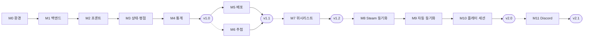

# PlayLedger — 개발 일정 / 마일스톤

> 단계별 개발 계획 및 완료 기준 정의

- **작성일**: 2026-08-13
- **개정일**: 2026-09-18
- **작성자**: 사공민규
- **버전**: v1.0
- **관련 문서**: 요구사항 정의서(01), 시스템 아키텍처(02), 데이터 모델(03), 화면 설계서(04)

---
 
## 1. 일정 수립 전제

| 항목 | 내용 |
|---|---|
| 개발 형태 | 1인 개인 프로젝트 (자기계발 · 취미) |
| 가용 시간 | 10/18까지: 학교 수업 시간을 포함해 대부분 (몰입 구간) · 10/19 출근 이후: 퇴근 후와 주말에 틈틈이 |
| 일정 단위 | 마일스톤 단위. 날짜를 고정하지 않는다 |
| 릴리즈 목표 | v1.0(M4)을 출근 전에 도달하는 것을 목표로 하되, 강제하지 않는다 |

**v1.0을 출근 전 목표로 두는 이유**

출근 후에는 가용 시간이 크게 줄어든다. 몰입할 수 있는 지금 "실제로 돌아가는 앱"까지
도달해두면, 이후에는 기능을 하나씩 얹는 재미로 이어갈 수 있다.
반대로 v1.0 전에 멈추면 완성품 없이 중단될 가능성이 크다.
목표일은 방향을 잡는 기준일 뿐이며, 못 맞춰도 계획을 실패로 보지 않는다.

**새로 배우는 것이 두 개라는 점**

Vue와 비동기 SQLAlchemy를 처음 다룬다. 두 개를 한 단계에서 같이 배우면
문제가 생겼을 때 어느 쪽 문제인지 판별하기 어렵다.
따라서 M1(백엔드)을 완전히 끝낸 뒤 M2(프론트)로 넘어간다.
 
---
 
## 2. 마일스톤 요약

| ID | 마일스톤 | 버전 | 예상 소요 | 상태 |
|---|---|:---:|:---:|:---:|
| M0 | 환경 구성 | v1.0 | 3~5일 | 🔄 진행중 |
| M1 | 백엔드 기초 (인증 + CRUD + 테스트) | v1.0 | 1.5~2주 | ⏳ 예정 |
| M2 | 프론트 연동 | v1.0 | 1주 | ⏳ 예정 |
| M3 | 상태 관리 + 평점 | v1.0 | 3~5일 | ⏳ 예정 |
| M4 | 통계 대시보드 | **v1.0** | 1주 | ⏳ 예정 |
| M5 | 배포 | v1.1 | 1~2주 | ⏳ 예정 |
| M6 | 다음 게임 추첨 | v1.1 | 3~5일 | ⏳ 예정 |
| M7 | 위시리스트 + 구매 전 경고 | v1.2 | 1~2주 | ⏳ 예정 |
| M8 | Steam 동기화 | v2.0 | 1~2주 | ⏳ 예정 |
| M9 | Steam 자동 동기화 | v2.0 | 1~2주 | ⏳ 예정 |
| M10 | 플레이 세션 + 히트맵 | v2.0 | 1~2주 | ⏳ 예정 |
| M11 | Discord 로그인 | v2.1 | 1~2주 | ⏳ 예정 |

v1.0(M0~M4)은 몰입 구간 기준 약 4~5주, M5 이후는 출근 후 기준이다.

> v0(RN + Django + MariaDB)의 진행 결과(M0 · M1 완료, M2 일부)는
> `v0-rn-django` 태그의 이 문서에 보존되어 있다. 이 문서의 M0 ~ M11은 새 스택 기준으로 다시 시작한다.
 
---
 
## 3. 마일스톤 상세

### M0. 환경 구성

| 항목 | 내용 |
|---|---|
| 목표 | 개발 환경을 갖추고, 화면 → 서버 → DB가 한 줄로 이어지는 것을 확인 |
| 기술 요소 | Docker Compose, PostgreSQL, FastAPI, Uvicorn, SQLAlchemy(async), Alembic, Vite, Vue 3, TypeScript, Tailwind, shadcn-vue |

**작업 목록**

*재설계 준비 (계획에 없던 작업)*
- [x] 재설계 전 상태를 `v0-rn-django` 태그로 보존
- [x] 구 스택 코드 제거 (`app/`, `server/`)
- [x] 01 ~ 04 문서 새 스택 기준으로 개정 (`ERD.md` → `03_erd.md` 포함)
- [x] 05 문서 새 스택 기준으로 개정
- [x] README 개정
- [x] DEVLOG에 스택 전환 결정 기록

*공통*
- [ ] `.gitignore`를 새 스택 기준으로 재작성 (**프로젝트 생성 전에 먼저**)
- [ ] `.gitattributes`로 줄바꿈 규칙(LF) 통일
- [ ] `docker-compose.yml` 작성 — PostgreSQL 컨테이너
- [ ] HeidiSQL로 PostgreSQL 접속 확인

*서버*
- [ ] `server/` 가상환경 생성, FastAPI · Uvicorn 설치
- [ ] `server/app/main.py` 헬스체크 API (`/api/health`)
- [ ] `.env` / `.env.example` 분리, 설정 로딩
- [ ] SQLAlchemy async 엔진으로 DB 연결 확인
- [ ] Alembic 초기화 (async 템플릿)
- [ ] `requirements.txt` 작성

*프론트*
- [ ] `web/` Vite + Vue 3 + TypeScript 프로젝트 생성
- [ ] Tailwind, shadcn-vue 설치
- [ ] Vite `/api` 프록시 설정

**완료 기준**
- [ ] `docker compose up` 후 HeidiSQL로 PostgreSQL에 접속됨
- [ ] `http://localhost:8000/docs`에서 Swagger 화면이 열림
- [ ] Vue 화면에 `/api/health` 응답이 표시됨 (프록시 경유 = 같은 출처 확인)
- [ ] `git status`에 `.env`, `venv/`, `node_modules/`가 안 잡힘

> **v0와 완료 기준이 다른 점:** v0의 M0는 "각 조각이 따로 돌아가는 것"까지였다.
> 이번에는 화면이 서버를 거쳐 응답을 받는 것까지 확인한다. 프록시 설정이 틀리면
> M2에서 로그인 쿠키가 안 붙는 문제로 뒤늦게 터지기 때문이다.
 
---

### M1. 백엔드 기초 (인증 + CRUD + 테스트)

| 항목 | 내용 |
|---|---|
| 목표 | 프론트 없이 백엔드만으로 모든 데이터 조작이 가능하고, 핵심 규칙이 자동 테스트로 보호되는 상태 |
| 기술 요소 | SQLAlchemy(async), Alembic, Pydantic, JWT, pytest, httpx, GitHub Actions |

**작업 목록**

*모델 · 마이그레이션*
- [ ] v1.0 범위 모델 정의 — `users`, `refresh_tokens`, `games`, `genres`, `game_genres`, `entries`
- [ ] 첫 마이그레이션 생성 후 `--sql` 옵션으로 실제 생성될 SQL 확인
- [ ] CHECK · UNIQUE · 외래키 삭제 규칙이 DB에 반영됐는지 HeidiSQL로 확인
- [ ] 초기 장르 데이터 입력 (시드)

*인증*
- [ ] 비밀번호 해싱 라이브러리 결정 (01 문서 10장)
- [ ] 회원가입 (email 소문자 정규화)
- [ ] 로그인 — access 토큰 + refresh 쿠키 발급
- [ ] 토큰 재발급 (rotation)
- [ ] 로그아웃 (refresh 토큰 폐기 + 쿠키 삭제)
- [ ] `get_current_user` 의존성

*게임 CRUD*
- [ ] 제목 정규화 함수 (`title_norm`)
- [ ] 게임 중복 판별 (`services`)
- [ ] 보유 기록 등록 · 목록 · 단건 · 수정 · 삭제 (`user_id` 필수 시그니처)
- [ ] 등록 시 장르 입력 (F-02)
- [ ] 장르 목록 조회 API

*테스트 · CI*
- [ ] pytest 환경 구성 (테스트 전용 DB)
- [ ] 사용자 격리 테스트
- [ ] 게임 중복 판별 테스트
- [ ] 토큰 만료 · rotation 테스트
- [ ] GitHub Actions로 push 시 pytest 자동 실행

*문서*
- [ ] `06_api_spec.md` 작성 — 인증 흐름과 에러 응답 규칙 (엔드포인트 목록은 Swagger에 맡긴다)

**완료 기준**
- [ ] "A 계정의 기록이 B 계정에 안 보임" 테스트 통과
- [ ] 다른 사용자의 기록을 ID로 직접 요청하면 404
- [ ] 폐기된 refresh 토큰으로 재발급을 요청하면 401
- [ ] GitHub Actions 초록불
- [ ] Swagger에서 가입 → 로그인 → 게임 등록 흐름을 손으로 한 번 확인

> **남의 기록 요청에 403이 아니라 404를 주는 이유:** 403(권한 없음)은
> "그 기록이 존재하긴 한다"는 사실을 알려준다. 로그인 실패 메시지를 하나로
> 통일하는 것(04 문서 3.1절)과 같은 원리다.
>
> **장르 입력(F-02)이 M1에 있는 이유:** v0에서는 M1 완료 후 M2로 이관됐었다.
> 이번에는 API가 먼저 완성돼야 한다는 원칙대로 백엔드 단계에 포함한다.
 
---

### M2. 프론트 연동

| 항목 | 내용 |
|---|---|
| 목표 | 브라우저에서 로그인하고, 목록을 보고, 게임을 추가할 수 있음 |
| 기술 요소 | Vue Router, Pinia, fetch, Tailwind, shadcn-vue |

**작업 목록**
- [ ] 메인 레이아웃 (768px 기준 사이드바 · 하단 탭)
- [ ] 라우터 + 로그인 가드 (04 문서 2.3절)
- [ ] API 호출 모듈 (`api/` — 토큰 첨부, 401 시 재발급 후 재시도)
- [ ] auth 스토어 (Pinia)
- [ ] S-01 로그인 · 가입
- [ ] S-02 라이브러리 목록 (20개씩 추가 로드)
- [ ] S-03 등록 폼 (장르 선택 포함)
- [ ] S-06 설정 (계정 정보, 로그아웃)
- [ ] 빈 상태 처리
- [ ] 로딩 표시 (skeleton)
- [ ] 오류 처리 (네트워크 실패, 401 만료)

**완료 기준**
- [ ] 새로고침해도 로그인이 유지되고, 로그인 화면이 깜빡이지 않음
- [ ] 화면에서 등록한 게임이 DB에 실제로 저장됨 (HeidiSQL로 확인)
- [ ] 데이터가 0개인 상태에서도 화면이 정상으로 보임
- [ ] 브라우저 개발자 도구의 모바일 폭에서 하단 탭으로 전환됨
 
---

### M3. 상태 관리 + 평점

| 항목 | 내용 |
|---|---|
| 목표 | 게임의 생애주기(등록 → 플레이 → 클리어)를 화면에서 관리 |
| 기술 요소 | Vue 조건부 렌더링, Motion |

**작업 목록**
- [ ] S-04 상세 화면
- [ ] 상세 화면에서 상태 직접 변경
- [ ] 평점 · 한줄평 입력 (`CLEARED` / `DROPPED`일 때만 노출)
- [ ] 평점 보존 규칙 (04 문서 4.3절)
- [ ] 상태별 필터 + 주소 쿼리 반영
- [ ] 카드 두 번째 줄 상태별 분기 (미시작은 방치일수)
- [ ] 수정 화면 (등록 폼 재사용)
- [ ] 삭제 (확인 다이얼로그)
- [ ] 저장 성공 알림 (toast + Motion)

**완료 기준**
- [ ] 04 문서 3.2절의 상태별 카드 표시가 5가지 상태 모두 동작
- [ ] 필터로 상태별 조회가 되고, 결과가 없으면 안내 문구 표시
- [ ] `PLAYING` → `CLEARED`로 바꾸면 평점 입력란이 나타남
- [ ] `CLEARED` → `PLAYING` → `CLEARED`로 바꿔도 이전 평점이 남아 있음
- [ ] 필터가 걸린 주소에서 새로고침해도 필터가 유지됨

---

### M4. 통계 대시보드 → **v1.0 릴리즈**

| 항목 | 내용 |
|---|---|
| 목표 | 이 프로젝트가 풀려는 문제("얼마나 안 하고 있는가")를 숫자로 보여줌 |
| 기술 요소 | SQL 집계(GROUP BY, JOIN, FILTER), 날짜 연산, ECharts |

**작업 목록**
- [ ] 테스트용 게임 데이터 20개 이상 입력 (시드 스크립트)
- [ ] 집계 쿼리를 HeidiSQL에서 먼저 검증 (03 문서 3장)
- [ ] 총계 (총 보유 / 미시작 수)
- [ ] 사장률
- [ ] 완주율 (분모에서 미시작 제외)
- [ ] 방치 게임 추출
- [ ] 시간당 비용 (플레이타임 0 처리 포함)
- [ ] 장르별 완주율
- [ ] 계산 함수 pytest
- [ ] S-05 통계 화면 (ECharts)
- [ ] `v1.0.0` 태그

**완료 기준**
- [ ] 게임 20개 이상 등록 상태에서 통계 화면의 모든 수치가 손으로 계산한 값과 일치
- [ ] 계산 함수 테스트 통과
- [ ] 플레이타임이 0인 게임의 시간당 비용이 `—`로 표시됨
- [ ] 게임이 0개인 계정에서 통계 화면이 오류 없이 안내 문구 표시

> **여기까지가 완결된 앱이다.** 이후 버전은 모두 이 위에 얹는 확장이다.
 
---

### M5. 배포 (v1.1)

| 항목 | 내용 |
|---|---|
| 목표 | 폰 브라우저로 어디서든 접속해 실제로 쓸 수 있는 상태 |
| 기술 요소 | Docker Compose(운영 구성), Nginx, HTTPS |

**작업 목록**
- [ ] 배포 환경 결정 (01 문서 10장)
- [ ] 서버 · 웹 Dockerfile
- [ ] 운영용 Compose 구성
- [ ] Nginx 설정 (`/` 정적 파일, `/api` 프록시)
- [ ] HTTPS 인증서
- [ ] 운영용 `.env`
- [ ] README 실행 방법 작성
- [ ] LICENSE 추가
- [ ] 클린룸 검증 (다른 PC에서 새로 클론)

**완료 기준**
- [ ] 폰 데이터(LTE)로 접속해 로그인 · 게임 등록이 됨
- [ ] 다른 PC에서 클론해 README만 보고 `docker compose up`으로 실행됨
- [ ] 클린룸 검증에서 발견된 문제가 모두 수정됨

> PulseGrid의 클린룸 검증에서 4건의 문제가 발견됐다. 같은 방식으로 검증한다.

---

### M6. 다음 게임 추첨 (v1.1)

| 항목 | 내용 |
|---|---|
| 목표 | 미시작 게임 중 하나를 골라 "오늘 할 게임"을 정해줌 (F-14) |
| 기술 요소 | Motion, 접근성(동작 줄이기) |

**작업 목록**
- [ ] 무작위 선택 API (서버가 결과 결정)
- [ ] S-07 추첨 다이얼로그
- [ ] 룰렛 연출 (Motion)
- [ ] 동작 줄이기 설정 대응
- [ ] `이걸로!` → 상태 `PLAYING` 변경 후 S-04 이동
- [ ] `v1.1.0` 태그

**완료 기준**
- [ ] 결과가 항상 `BACKLOG` 상태의 게임
- [ ] 미시작 게임이 0개면 버튼이 비활성화되고 안내가 보임
- [ ] OS 동작 줄이기를 켜면 회전 없이 결과만 표시됨

---

### M7. 위시리스트 + 구매 전 경고 (v1.2)

| 항목 | 내용 |
|---|---|
| 목표 | 다음 충동구매 전에 내 패턴을 숫자로 확인 (F-13, F-18) |
| 기술 요소 | 트랜잭션, 다중 JOIN 집계 |

**작업 목록**
- [ ] `wishlist_items` 모델 + 마이그레이션
- [ ] 위시리스트 CRUD API
- [ ] 구매 전 경고 쿼리 HeidiSQL 검증 (03 문서 3.4절)
- [ ] 구매 전 경고 API
- [ ] 구매 전환 API (트랜잭션)
- [ ] S-08 위시리스트 화면 + 경고 배지
- [ ] 구매 전환 다이얼로그
- [ ] 트랜잭션 테스트
- [ ] `v1.2.0` 태그

**완료 기준**
- [ ] 구매 전환 도중 오류를 강제로 일으키면 양쪽 테이블이 모두 원래 상태로 남음 (테스트)
- [ ] 경고 수치가 손으로 계산한 값과 일치
- [ ] 경고가 떠도 구매가 가능함
- [ ] 위시리스트 게임이 통계 수치에 섞이지 않음

---

### M8. Steam 동기화 (v2.0)

| 항목 | 내용 |
|---|---|
| 목표 | 라이브러리를 손으로 다 입력하지 않아도 되게 함 (F-12) |
| 기술 요소 | httpx(비동기 외부 API 호출), 데이터 병합, API 키 관리 |

**작업 목록**
- [ ] Steam Web API 키 발급, `.env` 분리
- [ ] `steam_id` 저장 + 프로필 공개 안내
- [ ] 보유 게임 목록 조회
- [ ] 병합 규칙 구현 (02 문서 5.1절)
- [ ] 동기화 결과 요약 (추가 N / 갱신 M / 변경 없음 K)
- [ ] S-06 Steam 연동 영역
- [ ] 비공개 프로필 오류 처리
- [ ] 병합 규칙 테스트

**완료 기준**
- [ ] 동기화 후 Steam 게임이 목록에 추가됨
- [ ] **직접 입력한 게임의 구매가 · 평점 · 한줄평이 그대로 남아 있음**
- [ ] 동기화를 두 번 연속 실행해도 중복 등록이 발생하지 않음
- [ ] 비공개 프로필로 동기화하면 원인이 담긴 메시지가 표시됨

> 완료 기준의 두 번째 조건이 이 단계의 본질이다. 데이터를 가져오는 것보다
> **기존 데이터를 지키는 것**이 어렵다.

---

### M9. Steam 자동 동기화 (v2.0)

| 항목 | 내용 |
|---|---|
| 목표 | 동기화 버튼을 누르지 않아도 매일 최신 상태 유지 (F-19) |
| 기술 요소 | Redis, 작업 큐, 워커, 스케줄러 |

**작업 목록**
- [ ] 작업 큐 도구 결정 (01 문서 10장)
- [ ] Redis 컨테이너 추가
- [ ] 워커 프로세스 구성
- [ ] 하루 1회 스케줄 등록
- [ ] Steam API 응답 캐싱

**완료 기준**
- [ ] 사용자 조작 없이 하루 1회 동기화 결과가 DB에 반영됨
- [ ] 같은 날 수동 · 자동 동기화가 모두 실행돼도 중복이 생기지 않음
- [ ] 워커가 동기화하는 동안에도 화면 응답이 느려지지 않음

---

### M10. 플레이 세션 + 히트맵 (v2.0)

| 항목 | 내용 |
|---|---|
| 목표 | "언제, 얼마나 하는지" 패턴을 날짜 단위로 기록하고 시각화 (F-20) |
| 기술 요소 | upsert, ECharts 캘린더 히트맵 |

**작업 목록**
- [ ] `play_sessions` 모델 + 마이그레이션
- [ ] 동기화 증가분 → 세션 생성 (기준점 규칙, 02 문서 5.1절)
- [ ] 수동 세션 추가 API
- [ ] 같은 날 합산 (upsert, 03 문서 3.6절)
- [ ] S-04 플레이 기록 영역
- [ ] S-05 활동 히트맵
- [ ] 세션 규칙 테스트
- [ ] `v2.0.0` 태그

**완료 기준**
- [ ] 첫 동기화에서는 세션이 생기지 않음 (기준점)
- [ ] 두 번째 동기화부터 증가분이 그날의 세션으로 기록됨
- [ ] 같은 날 두 번 기록하면 한 행으로 합산됨
- [ ] 수동 게임에 세션을 추가하면 기존 플레이타임에 더해짐 (01 문서 5.5절)

---

### M11. Discord 로그인 (v2.1)

| 항목 | 내용 |
|---|---|
| 목표 | Discord 계정으로 가입 · 로그인 (F-21) |
| 기술 요소 | OAuth 2.0, state 검증 |

**작업 목록**
- [ ] 계정 연결 정책 결정 (01 문서 10장)
- [ ] Discord 개발자 포털에 앱 등록
- [ ] `oauth_accounts` 모델 + 마이그레이션
- [ ] OAuth 흐름 구현 (02 문서 4.3절)
- [ ] S-01 `Discord로 계속하기` 버튼
- [ ] S-06 Discord 연결 영역
- [ ] `v2.1.0` 태그

**완료 기준**
- [ ] state 값이 다른 콜백 요청은 거부됨
- [ ] 결정한 연결 정책대로 이메일 계정과 Discord 계정이 연결 또는 분리됨
- [ ] 빌드된 프론트 파일에서 client secret이 검색되지 않음
 
---

## 4. 진행 순서 및 의존 관계

> 실선은 반드시 앞 단계가 끝나야 시작할 수 있는 관계, 점선은 권장 순서다.

- M0 ~ M4는 **순차 진행 필수**
- M8 → M9 → M10은 기술적으로 이어져 있다 (자동 동기화가 세션을 만든다)
- 점선 구간은 순서를 바꿔도 되지만, 버전 번호가 뒤섞이지 않도록 가급적 순서대로 진행한다

---
 
## 5. 일정 리스크

| 리스크 | 영향 | 대응 |
|---|---|---|
| 출근(10/19) 후 가용 시간 급감 | v1.0 전에 멈춤 | 몰입 구간에 v1.0 도달을 목표로 한다. 못 맞추면 마일스톤 단위로 끊어서 이어간다 |
| 몰입 구간 과부하 | 번아웃, 흥미 상실 | 세션 단위 목표를 작게 잡고, 세션 종료 절차(DEVLOG 기록)를 유지한다 |
| 마감 없는 범위 확대 | 완성 시점 소실 | 새 아이디어는 구현하지 않고 01 문서 4.4절에 추가만 한다 |

기술적 리스크(학습 곡선, 외부 API 제약 등)는 01 문서 8장에서 관리한다.
 
---
 
## 6. 완료 정의 (Definition of Done)

각 마일스톤은 아래를 **모두** 충족해야 완료로 본다.

1. 해당 단계의 완료 기준 체크박스가 전부 채워짐
2. 코드가 Git에 커밋되어 있음
3. DEVLOG에 해당 세션 기록이 남아 있음
4. 임시 코드 / 주석 처리한 실험 코드가 제거됨
5. 테스트가 있는 단계는 GitHub Actions가 통과함
6. 버전의 마지막 마일스톤이면 버전 태그가 찍혀 있음

---
 
## 7. 문서 갱신 규칙
 
- 작업 항목을 완료하면 **그때 바로** 체크한다. 나중에 몰아서 하면 기억이 왜곡된다
- 계획에 없던 작업을 했으면 체크박스를 **추가하고** 체크한다. 지우지 않는다
- 마일스톤 상태(2장 표)는 완료 기준을 전부 충족한 시점에만 ✅로 바꾼다
- 범위를 바꿨으면 변경 이력에 **사유와 함께** 남긴다
- 완료 기준은 "속을 수 없는 형태"로 쓴다. "동작함"이 아니라 "A 계정 기록이 B 계정에 안 보임"처럼 판정 가능해야 한다

> 계획대로 안 된 흔적을 지우지 않는 것이 이 문서의 목적이다.
> 결과만 남은 문서는 결과만 알려주지만, 과정이 남은 문서는 판단 근거를 알려준다.
 
---
 
## 8. 변경 이력
 
| 버전 | 날짜 | 내용 |
|---|---|---|
| v0.1 | 2026-08-13 | 최초 작성 |
| v0.2 | 2026-08-13 | 작업 목록을 체크박스로 전환(표 셀 → 목록), 완료 기준도 체크박스화, M0에 `.gitignore` 선행 항목 추가, 2장에 상태 열 추가, 문서 갱신 규칙(7장) 신설 |
| v0.3 | 2026-08-14 | M0 완료 처리 — 작업 목록·완료 기준 체크박스 전부 체크, 2장 상태표 ✅로 변경. RN 환경은 CLI로 확정(당초 리스크 대응책은 Expo였으나 안드로이드 스튜디오 기설치·USB 실기기 준비로 CLI 진입 장벽이 없어 계획대로 진행) |
| v0.4 | 2026-08-14 | M1 "모델" 섹션 완료 처리 — accounts/library 앱 생성부터 관리자 페이지 확인까지 작업 목록 체크박스 7개 체크. 인증/CRUD 섹션은 미체크 상태로 진행 중 유지 |
| v0.5 | 2026-08-17 | M1 "인증" 섹션 체크박스 3/4 완료 처리 — DRF 설정·회원가입·로그인. 권한 클래스 항목은 CRUD 구현과 함께 검증 예정으로 미체크 유지 |
| v0.6 | 2026-08-17 | M1 완료 처리 — 인증(권한 클래스)·게임 CRUD 전 항목 체크, 2장 상태표 ✅로 변경. 계획에 없던 admin title_norm 안전장치 작업 추가 기록. F-02(장르 입력)는 M2로 이관하며 사유 명시 |
| v0.7 | 2026-08-17 | M2 "React Navigation 설치, 하단 탭 + 스택 구조 세팅" 항목 완료 처리. 2장 상태표 M2를 🔄 진행중으로 변경 (M2 착수 반영) |
| v1.0 | 2026-09-18 | 스택 전환(Vue 3 + FastAPI + PostgreSQL)에 따른 전면 개정. 마일스톤을 M0~M11 · 버전별(v1.0~v2.1)로 재구성, 일정 전제를 취업 후 자기계발 기준으로 변경, 재설계 준비 작업을 M0에 기록, 기술 리스크를 01 문서로 이관하고 일정 리스크만 유지, 완료 정의에 CI 통과 · 버전 태그 추가. v0 진행 결과는 `v0-rn-django` 태그 참고 |
