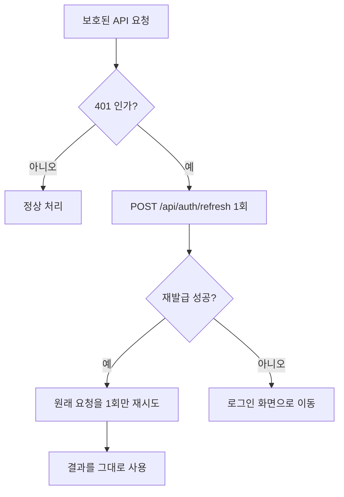

# PLAYLEDGER ─ API 명세

> SERVER가 제공하는 API의 공통 규칙

- **작성일**: 2026-09-27
- **작성자**: 사공민규
- **버전**: v1.0
- **관련 문서**: 요구사항 정의서(01), 시스템 아키텍처(02), 데이터 모델(03), UI 설계(04)

---

## 1. 범위

이 문서는 PLAYLEDGER SERVER가 **제공하는** API의 공통 규칙을 다룬다.
개별 ENDPOINT의 PATH · REQUESTS 본문 · RESPONSES SCHEMA는 적지 않는다.

| 알고 싶은 것 | 보는 곳 |
|---|---|
| ENDPOINT LIST, REQUESTS · RESPONSES SCHEMA | Swagger (`/docs`) |
| 인증 흐름의 설계 근거, TOKEN 종류와 보관 위치 | `ARCHITECTURE` 4.1절 |
| 외부 API(Steam · Discord)를 **호출하는** 규약 | `ARCHITECTURE` 5장 |
| ERROR 문구가 화면에 어떻게 보이는지 | `UI_DESIGN` 3장 |
| 인증 계약 · ERROR RESPONSES RULES | 문서 3 · 4장 |

**ENDPOINT LIST를 수기 작성하지 않는 이유**

코드가 바뀌면 Swagger는 자동으로 따라오지만 문서는 따라오지 않는다.
코드와 문서가 어긋나게 되면 "문서에는 있는데 동작하지 않는 API"가 생기게 되고,
그 때부터 문서 전체의 신뢰가 무너진다.
자동으로 최신을 유지할 수 있는 정보는 자동에 맡기고,
이 문서는 **코드만 보고는 알 수 없는 약속**만 담는다.

---

## 2. 공통 규약

**기본 경로** · 모든 API는 `/api`로 시작한다. (`ARCHITECTURE` 1.1절 ─ Nginx · Vite 프록시가 이 접두사로 화면과 서버를 가른다)

**형식** · REQUESTS · RESPONSES 본문은 JSON, ENCODING은 UTF-8이다.

**시각** · 모든 시각 값은 UTC 기준 ISO 8601 문자열로 표시된다. (예: `2026-09-23T04:49:29.739573Z`)
끝의 `Z`는 UTC를 의미한다. 화면에 표시할 때 사용자의 시간대로 변환하는 것은 클라이언트의 몫이다.
단, 날짜만 다루는 값(`purchased_at`)은 시각 없이 `2026-09-23` 형태이다.

### 2.1 인증 정보를 붙이는 방법

| TOKEN | 붙는 방법 | 붙는 범위 |
|---|---|---|
| access | `Authorization: Bearer {TOKEN}` 헤더를 **직접** 넣는다 | 넣은 요청에만 |
| refresh | BROWSER가 COOKIE(`pl_refresh_token`)를 **자동으로** 붙인다 | `/api/auth` 아래 요청에만 |

REFRESH COOKIE의 범위가 좁은 것은 `Path=/api/auth`로 심었기 때문이다.
`/api/entries` 같은 요청에는 처음부터 첨부되지 않으므로, 그쪽에서 COOKIE를 찾으면 없는 것이 정상이다.

### 2.2 성공 응답 코드

| 코드 | 사용되는 경우 | 예시 |
|---|---|---|
| 200 | 조회 · 수정 성공 | 목록, 단건, 로그인 |
| 201 | 새로 만들어짐 | 회원가입, 보유 기록 등록 |
| 204 | 성공한 요청은 맞으나 돌려줄 본문이 없음 | 로그아웃, 보유 기록 삭제 |

201과 204는 단순히 "성공"의 의미만을 담고 있는 200과는 달리 **무슨 일이 일어났는지**까지 알려준다.
등록 요청에 200이 오면 클라이언트가 이 요청이 새로 만들어진 요청인지 이미 존재하던 요청인지 구분할 수 없다.

### 2.3 에러 응답의 공통 형태

```json
{ "detail": "이미 등록된 게임입니다" }
```

`detail` 하나만 표기되고, 값은 **사용자에게 그대로 보여줄 수 있는 한국어 문장**이다.
에러 코드 번호나 영문 키를 따로 두지 않는다 ─ 화면이 코드를 문장으로 번역하는 표를
따로 관리하게 되면, 서버와 화면 두 곳에 문구가 흩어진다.

> 단, 422(입력 형식 오류)만 `detail`의 값이 문자열이 아니다. 문서 4.4절 참고.
> FastAPI의 500 기본 응답은 영문이다. 화면에는 고정된 안내 문구를 표시한다.

---

## 3. 인증 계약

이 장은 클라이언트가 인증을 다룰 때 **반드시 지켜야 하는 동작**을 규정한다.
인증 흐름의 설계 근거와 TOKEN의 성격은 `ARCHITECTURE` 4.1절을 따른다.

### 3.1 TOKEN의 획득

로그인(`POST /api/auth/login`)과 재발급(`POST /api/auth/refresh`)은 동일한 형태로 응답한다.

```json
{ "access_token": "eyJhbGciOiJIUzI1NiIs...", "token_type": "bearer" }
```

refresh TOKEN은 응답 본문에 포함되지 않으며, `Set-Cookie` 헤더로만 전달된다.
본문에 담으면 JavaScript가 읽을 수 있게 되어 `HttpOnly` 속성의 의미가 사라진다.

access TOKEN은 메모리에만 보관한다. `localStorage` 등 영속 저장소에 기록하지 않는다.

### 3.2 401 응답의 처리



다음 4가지를 규칙으로 둔다.

**① 재발급은 1회만 시도한다.**
재발급에 성공한 뒤의 재시도에서 다시 401이 오면 더 이상 재발급하지 않고 로그인 화면으로 보낸다.

**② 인증 API 자체가 반환한 401은 재발급 대상이 아니다.**
`/api/auth/login`과 `/api/auth/refresh`의 401은 각각 자격 증명 오류와 세션 만료를 뜻한다.
이를 재발급으로 처리하면 요청이 스스로를 호출하는 순환이 발생한다.

**③ 재발급 요청은 동시에 두 번 이상 보내지 않는다.**
여러 요청이 동시에 401을 받더라도 재발급은 1번만 수행하고, 나머지는 그 결과를 기다린다.
refresh TOKEN은 사용할 때마다 교체되므로(rotation), 동일한 TOKEN으로 동시에 두 번 요청하면
뒤늦게 도착한 쪽은 이미 폐기된 TOKEN을 제시한 것이 된다.
SERVER는 이를 **탈취 신호로 간주해 해당 사용자의 모든 TOKEN을 폐기**하며,
그 결과 정상 사용자가 로그아웃된다. (`ARCHITECTURE` 4.1절 재사용 감지)

**④ 분기의 판단은 상태 코드와 요청 경로로만 한다.**
응답의 `detail` 문구는 사용자에게 표시하기 위한 값이며, 조건 분기의 기준으로 삼지 않는다.
문구가 수정되는 순간 동작이 함께 바뀌기 때문이다.

### 3.3 로그인 상태의 복원

access TOKEN은 메모리에만 존재하므로 새로고침하면 사라진다.
APPLICATION을 시작할 때 `POST /api/auth/refresh`를 먼저 호출해 TOKEN을 복원한다.

이때의 401은 오류가 아니라 **로그인하지 않은 상태**를 의미한다.
ERROR MESSAGE를 표시하지 않고 비로그인 상태로 시작한다.

### 3.4 로그아웃

`POST /api/auth/logout`은 COOKIE의 유무와 관계없이 항상 204로 응답한다. (멱등)
클라이언트는 응답을 기다리되 그 결과와 무관하게 메모리의 access TOKEN과 로그인 상태를 초기화한다.

---

## 4. 에러 응답 규칙

### 4.1 상태 코드 사용 기준

| 코드 | 의미 | 사용하는 경우 |
|---|---|---|
| 401 | 인증 실패 | 자격 증명 오류, TOKEN 없음 · 만료 · 위조 |
| 404 | 대상 없음 | 존재하지 않거나, **내 것이 아닌** RESOURCES |
| 409 | 상태 충돌 | 요청 형식은 옳으나 현재 DATA와 어긋남 |
| 422 | 값 오류 | 요청 값이 규칙을 만족하지 않음 |
| 500 | 서버 오류 | 예상치 못한 실패. 다른 코드로 가리지 않는다 |

403은 사용하지 않는다. 4.3절 참고.

400 대신 409를 사용하는 기준은 **요청 자체가 잘못됐는가, 서버의 현재 상태와 부딪혔는가**이다.
이미 가입된 이메일로 다시 가입하는 요청은 형식상 아무 문제가 없다. 동일한 요청이라도
그 이메일이 아직 비어 있었다면 성공했을 것이므로, 잘못된 것은 요청이 아니라 타이밍이다.

### 4.2 401이 발생하는 네 지점

| 문구 | 발생 지점 | 함께 일어나는 현상 |
|---|---|---|
| `인증이 필요합니다` | 보호된 모든 API (`get_current_user`) | `WWW-Authenticate: Bearer` 헤더 동반 |
| `이메일 또는 비밀번호가 올바르지 않습니다` | `POST /api/auth/login` | 존재하지 않는 계정에도 해시 검증을 1회 수행하여 응답 시간을 맞춘다 |
| `인증 정보가 없습니다` | `POST /api/auth/refresh` ─ COOKIE 없음 | 없음 |
| `다시 로그인해 주세요` | `POST /api/auth/refresh` ─ 폐기 · 만료 · 미등록 TOKEN | **refresh COOKIE가 함께 삭제된다** |

세 번째와 네 번째가 나뉘어 있는 것은 의도된 설계이다.
"COOKIE를 보내지 않았다"는 요청자가 이미 알고 있는 사실이므로 알려주어도 정보가 새어나가지 않는다.
반면 네 번째를 "만료됨 / 폐기됨 / 존재하지 않는 TOKEN"으로 세분하면,
공격자가 훔친 TOKEN의 상태를 SERVER에 물어볼 수 있게 된다.

### 4.3 404를 사용하고 403을 사용하지 않는 이유

다른 USER의 RESOURCES에 접근하면 403(권한 없음)이 아니라 404(없음)로 응답한다.

403은 "그 RESOURCES는 존재하지만 권한이 없다"는 의미이다.
이 응답은 요청자에게 **해당 id의 데이터가 실재한다는 사실**을 알려준다.
id를 1부터 차례로 요청하면 전체 기록의 개수와 분포를 추측할 수 있다.

내 것이 아닌 기록은 처음부터 존재하지 않는 것처럼 보여야 한다.
조회 · 수정 · 삭제 모두 동일하게 404 `기록을 찾을 수 없습니다`로 응답한다.

> 이 규칙은 자동 테스트로 검증한다. (`tests/test_entry_isolation.py`)

> `HTTPBearer`의 기본 동작은 403이다. `auto_error=False`로 끄고 401을 직접 던져 이 규칙을 지킨다.

### 4.4 422 본문의 형태

422의 본문은 2가지 형태이다.
동일한 422라도 누가 생성했는지에 따라 `detail`의 자료형이 다르다.

**① Pydantic 생성 형태** ─ 타입 · 길이 · 범위 위반. `detail`이 **배열**이다.

```json
{
  "detail": [
    {
      "type": "string_too_short",
      "loc": ["body", "password"],
      "msg": "String should have at least 8 characters",
      "input": "123",
      "ctx": { "min_length": 8 }
    }
  ]
}
```

**② SERVER의 생성 형태** ─ 형식은 맞으나 값이 실재하지 않는 경우. `detail`이 문자열이다.

```json
{ "detail": "존재하지 않는 장르가 포함되어 있습니다" }
```

클라이언트는 422를 받으면 **`detail`의 자료형을 먼저 확인해야 한다.**
문자열이면 그대로 표시하고, 배열이면 각 항목의 `loc`으로 어느 입력란인지 찾아
해당 칸 아래에 메시지를 붙인다. 자료형 확인 없이 그대로 표시하면
배열인 경우 사용자에게 `[object Object]`의 형태로 보여진다.

`msg`는 영문이며 USER에게 보여줄 문장이 아니다.
화면에 표시할 한국어 문구는 `loc`으로 입력란을 특정한 뒤 클라이언트가 결정한다. (`UI_DESIGN` 3.1절)

`ctx`는 위반한 규칙의 기준값이며 오류 종류에 따라 있을 수도, 없을 수도 있다.
한국어 문구를 생성할 때 "최소 8자" 같은 형태로 숫자를 넣는 데에 사용할 수 있다.

### 4.5 문구를 합치는 기준과 나누는 기준

**합친다** ─ 구분하여 알리는 것이 요청자에게 새로운 정보가 되는 경우.
로그인 실패(계정 없음 / 비밀번호 오류)와 재발급 실패(폐기 / 만료 / 미등록)가 여기 해당된다.
문구뿐 아니라 **응답 시간과 상태 코드까지** 같아야 한다. 셋 중 하나라도 갈리면 구분이 가능해진다.

**나눈다** ─ USER가 그 정보를 받아 행동을 바꿀 수 있는 경우.
`이미 등록된 게임입니다`와 `존재하지 않는 장르가 포함되어 있습니다`가 그렇다.
무엇을 고쳐야 하는지 알려주지 않으면 USER는 같은 실패를 반복한다.

> **예외** · 회원가입의 `이미 사용 중인 이메일입니다` MESSAGE는 계정 존재 여부를 노출한다.
> 이를 막기 위해서는 가입을 항상 성공으로 응답하고 메일로 안내해야 하므로 v1.0 릴리즈 범위를 벗어난다.
> 로그인은 상기 기준으로 막아놓았다. 완전 차단은 `REQUIREMENTS` 4.4절 F-27 참고.

---

## 5. 변경 이력

| 버전 | 날짜 | 내용 |
|---|---|---|
| v1.0 | 2026-09-28 | 최초 작성. M1에서 구현한 인증 · 보유 기록 API를 기준으로 공통 규약 · 인증 계약 · 에러 응답 규칙을 정리. ENDPOINT LIST는 Swagger에 위임 |
