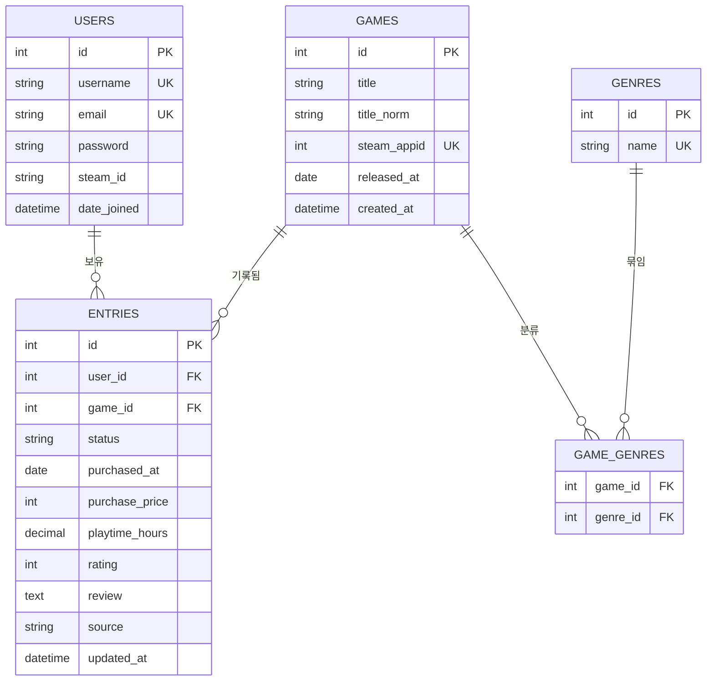

# PlayLedger — 데이터 모델 (ERD)

> 작성일: 2026-08-13 / 상태: 실물 반영 (v0.2)
> 관련 문서: `01_requirements.md`

---

## 1. 전체 구조



### 관계 요약

| 관계 | 종류 | 의미 |
|---|:---:|---|
| USERS → ENTRIES | 1:N | 사용자 1명이 보유 기록 여러 개를 가진다 |
| GAMES → ENTRIES | 1:N | 게임 1개가 여러 사용자의 보유 기록에 등장한다 |
| GAMES ↔ GENRES | N:M | 게임 1개에 장르 여러 개, 장르 1개에 게임 여러 개 |

---

## 2. 테이블 상세

### 2.1 `users`

Django 기본 인증 모델(`AbstractUser`)을 확장해서 사용한다.
비밀번호 해싱, 로그인, 세션 관리는 Django가 제공하는 것을 그대로 쓴다.

| 컬럼 | 타입 | 제약 | 설명 |
|---|---|---|---|
| `id` | int | PK | |
| `username` | varchar(150) | UNIQUE, NOT NULL | 로그인 ID |
| `email` | varchar(254) | UNIQUE, NOT NULL | |
| `password` | varchar(128) | NOT NULL | 해싱된 값. 평문 저장 금지 |
| `steam_id` | varchar(20) | NULL | Steam 64비트 ID. 연동 안 한 사용자는 NULL |
| `date_joined` | datetime | NOT NULL | 가입일 |

**직접 만들지 않는 이유:** 인증은 보안 사고가 나기 가장 쉬운 영역이다.
Django가 제공하는 검증된 구현을 쓰고, 학습의 초점은
"인증이 어떻게 동작하는가"를 이해하는 데 둔다.

---

### 2.2 `games`

게임 자체의 정보. **모든 사용자가 공유하는 마스터 데이터**다.
사용자가 몇 명이든 사이버펑크 2077은 이 테이블에 한 행만 존재한다.

| 컬럼 | 타입 | 제약 | 설명 |
|---|---|---|---|
| `id` | int | PK | |
| `title` | varchar(200) | NOT NULL | 화면에 표시할 제목 |
| `title_norm` | varchar(200) | NOT NULL, INDEX | 정규화된 제목 (중복 판별용) |
| `steam_appid` | int | UNIQUE, NULL | Steam 고유 ID |
| `released_at` | date | NULL | 출시일 |
| `created_at` | datetime | NOT NULL | 등록 시각 |

**`title`과 `title_norm`을 나누는 이유**

같은 게임이 여러 표기로 입력될 수 있다.

| 입력값 | `title_norm` |
|---|---|
| `사이버펑크 2077` | `사이버펑크2077` |
| `Cyberpunk 2077` | `cyberpunk2077` |
| `사이버펑크2077` | `사이버펑크2077` |

정규화 규칙: 공백 제거 → 소문자 변환 → 특수문자 제거.
중복 여부는 항상 `title_norm`으로 판별하고, 화면에는 `title`을 보여준다.

> 한글 표기와 영문 표기는 정규화해도 서로 다른 값이 된다.
> 이 경우까지 잡으려면 별칭(alias) 테이블이 필요하지만,
> MVP 범위에서는 다루지 않는다. (PartScope의 `model_aliases`와 같은 문제)

**중복 판별 순서**

1. `steam_appid`가 있으면 그것으로 비교 (가장 정확)
2. 없으면 `title_norm`으로 비교
3. 둘 다 일치하지 않으면 새 게임으로 등록

---

### 2.3 `genres` / `game_genres`

장르는 게임과 다대다(N:M) 관계이므로 연결 테이블이 필요하다.

**`genres`**

| 컬럼 | 타입 | 제약 | 설명 |
|---|---|---|---|
| `id` | int | PK | |
| `name` | varchar(50) | UNIQUE, NOT NULL | 장르명 |

**`game_genres`** (연결 테이블)

| 컬럼 | 타입 | 제약 | 설명 |
|---|---|---|---|
| `game_id` | int | FK → games.id | |
| `genre_id` | int | FK → genres.id | |

`(game_id, genre_id)` 복합 UNIQUE. 같은 짝이 두 번 들어가는 것을 막는다.

**연결 테이블을 쓰는 이유**

`games` 테이블에 `장르1 / 장르2 / 장르3` 컬럼을 두는 방식은
장르 개수가 고정되고, 장르로 검색할 때 모든 컬럼을 뒤져야 한다.
문자열로 `"RPG, 오픈월드"`처럼 이어 붙이면 DB가 이를 데이터로 인식하지 못해
F-11(장르별 통계)을 구현할 수 없다.

---

### 2.4 `entries`

특정 사용자가 특정 게임을 보유한 기록. **이 프로젝트의 중심 테이블**이다.

| 컬럼 | 타입 | 제약 | 설명 |
|---|---|---|---|
| `id` | int | PK | |
| `user_id` | int | FK → users.id, NOT NULL | |
| `game_id` | int | FK → games.id, NOT NULL | |
| `status` | varchar(10) | NOT NULL | 진행 상태 (아래 참조) |
| `purchased_at` | date | NULL | 구매일 |
| `purchase_price` | int | NULL | 구매가 (원) |
| `playtime_hours` | decimal(6,1) | NOT NULL, 기본 0 | 총 플레이타임 |
| `rating` | tinyint | NULL | 1~5 평점 |
| `review` | text | NULL | 한줄평 |
| `source` | varchar(10) | NOT NULL | `MANUAL` / `STEAM` |
| `updated_at` | datetime | NOT NULL | 최종 수정 시각 |

`(user_id, game_id)` 복합 UNIQUE. 같은 사용자가 같은 게임을 두 번 등록할 수 없다.

**`status` 값**

| 값 | 의미 | 백로그 분석 대상 |
|---|---|:---:|
| `BACKLOG` | 미시작 | O |
| `PLAYING` | 플레이중 | X |
| `CLEARED` | 클리어 | X |
| `ON_HOLD` | 보류 | O |
| `DROPPED` | 포기 | X |

`ON_HOLD`와 `DROPPED`를 나누는 이유는 분석 대상이 다르기 때문이다.
보류는 돌아올 가능성이 있으니 백로그에 포함하고, 포기는 이미 끝난 것으로 본다.

**`source`가 필요한 이유**

M5에서 Steam 동기화를 실행할 때, 사용자가 직접 수정한 값을
API 응답이 덮어쓰면 안 된다. 동기화 규칙:

- `source = 'STEAM'` → 플레이타임을 API 값으로 갱신
- `source = 'MANUAL'` → 건드리지 않음
- 구매가, 평점, 한줄평은 Steam에 없는 정보이므로 항상 보존

이 컬럼 하나가 "자동 수집 데이터와 수동 데이터의 충돌"이라는
문제 전체를 해결한다.

**타입 선택 근거**

| 컬럼 | 선택 | 이유 |
|---|---|---|
| `playtime_hours` | decimal | Steam은 분 단위로 응답한다. int면 0.5시간이 0이 된다 |
| `purchase_price` | int | 원 단위 정수. 소수점이 필요 없다 |
| `rating` | NULL 허용 | 미평가와 0점은 다르다. 평균 계산 시 NULL은 제외된다 |
| `purchased_at` | NULL 허용 | Steam 동기화로 들어온 게임은 구매일을 알 수 없다 |

---

## 3. 주요 조회 패턴

### 3.1 목록 조회 (F-03)

`entries`에는 제목이 없으므로 `games`와 JOIN해야 한다.

```sql
SELECT g.title, e.status, e.playtime_hours, e.purchase_price
FROM entries e
JOIN games g ON e.game_id = g.id
WHERE e.user_id = ?
ORDER BY e.updated_at DESC;
```

### 3.2 방치 게임 추출 (F-09)

```sql
SELECT g.title, DATEDIFF(CURDATE(), e.purchased_at) AS idle_days
FROM entries e
JOIN games g ON e.game_id = g.id
WHERE e.user_id = ?
  AND e.status = 'BACKLOG'
  AND e.purchased_at IS NOT NULL
ORDER BY idle_days DESC;
```

### 3.3 장르별 통계 (F-11)

세 테이블을 거쳐야 한다.

```sql
SELECT gn.name,
       COUNT(*) AS total,
       SUM(e.status = 'CLEARED') AS cleared
FROM entries e
JOIN games g       ON e.game_id = g.id
JOIN game_genres gg ON gg.game_id = g.id
JOIN genres gn      ON gn.id = gg.genre_id
WHERE e.user_id = ?
GROUP BY gn.id;
```

---

## 4. 인덱스 계획

| 테이블 | 컬럼 | 목적 |
|---|---|---|
| `entries` | `(user_id, status)` | 상태별 필터링이 가장 잦은 조회 |
| `entries` | `(user_id, game_id)` | UNIQUE 겸 중복 등록 방지 |
| `games` | `title_norm` | 중복 판별 시 매번 조회 |
| `games` | `steam_appid` | UNIQUE 겸 동기화 시 조회 |

> 데이터가 적을 때는 인덱스 없이도 빠르다.
> 지금은 "어디에 필요할지"만 기록해두고, 실제 추가는 M4 이후 측정 후 결정한다.

---

## 5. 확장 여지 (지금은 안 함)

구조상 나중에 붙이기 쉬운 것들:

- **플레이 세션 기록** — `sessions` 테이블 추가 (`entries`와 1:N)
- **다른 플랫폼 연동** — `entries.source`에 `EPIC`, `GOG` 값 추가로 대응 가능
- **위시리스트** — `entries.status`에 `WISHLIST` 추가 또는 별도 테이블

`source` 컬럼을 처음부터 문자열로 둔 덕분에,
플랫폼이 늘어나도 스키마를 바꿀 필요가 없다.

---

## 변경 이력

| 날짜 | 버전 | 내용 |
|---|---|---|
| 2026-08-13 | v0.1 | 최초 작성 |
| 2026-08-17 | v0.2 | `entries.playtime_hours` 타입을 실제 구현(`models.py`) 기준으로 decimal(7,1) → decimal(6,1) 정정. max_digits=6, decimal_places=1로는 최대 99999.9시간까지 표현 가능해 실사용 범위를 충분히 커버하므로 코드가 아닌 문서를 실물에 맞춤 |
